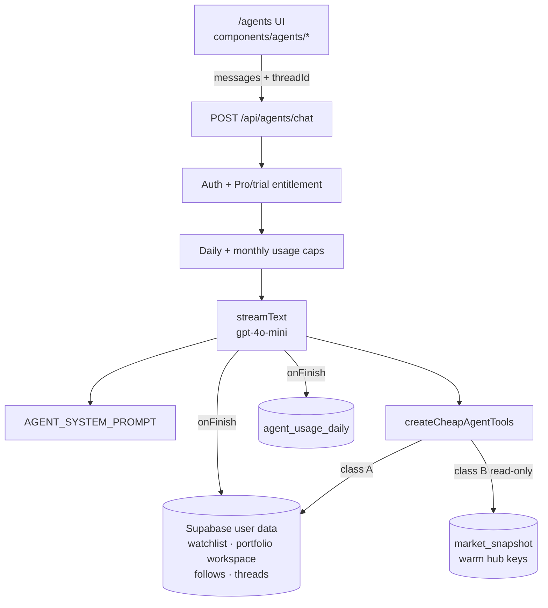

# Finsepa Agent — Engineering Reference

Living source of truth for how Agent is built, what it may touch, and how to extend it safely.

**Product surface:** `/agents` (chat + thread history)  
**Stack:** Vercel AI SDK (`streamText` + tools) · OpenAI `gpt-4o-mini` · Supabase (auth, threads, usage, user workspace) · warm `market_snapshot` hub rows

---

## 1. Goals & non-goals

| Do | Do not |
|----|--------|
| Answer questions about **this user’s** Finsepa workspace (watchlist, portfolios, follows) | Call live EODHD / cold market rebuilds from Agent tools |
| Read **warm hub snapshots** (news, earnings week, economy week, macro) when present | Invent prices, calendars, or macro figures when a hub row is cold |
| Cap LLM spend per user (daily + monthly) | Let one user burn market-data credits or unbounded OpenAI spend |
| Persist private chat threads | Store tool dumps or market payloads in message history (text replies only today) |
| Stay **read-only** unless a future write tool is explicitly approved | Claim trades/watchlist edits happened without a real write path |

**Cost model:** Agent cost is **LLM tokens only**. Market data for Agent must be free relative to EODHD — either already on the user row / portfolio workspace, or already ingested into hub snapshots by cron / page warm paths.

---

## 2. Architecture

### Request path (`POST /api/agents/chat`)

1. Resolve signed-in user  
2. Entitlement (`assertAgentEntitlement` — same Pro / active trial gate as the main app)  
3. Require `OPENAI_API_KEY`  
4. Validate `messages` + required `threadId` (thread must belong to user)  
5. Enforce monthly then daily caps  
6. Trim history to `maxHistoryChars`  
7. `streamText` with system prompt + `createCheapAgentTools(userId)`  
8. `stopWhen: stepCountIs(6)`, `maxOutputTokens: 1024`  
9. On finish: record usage + append user/assistant text to the thread  

**Important:** Tools run **on the server** inside the chat route. The model chooses tools; users do not approve each call. Capabilities are fixed at deploy time by the toolbox + prompt.

---

## 3. Data classes (must stay true)

Every tool must fit **exactly one** class. If it does not, do not ship it.

### Class A — User Supabase / workspace (preferred)

- Watchlist collections  
- Portfolio workspace blob (saved marks, holdings, ledger)  
- Superinvestor follows  
- Pure math on already-loaded workspace data (weights, concentration, overlap)

**Files:** `lib/agents/agent-tools.ts`, `lib/agents/agent-portfolio-bundle.ts`, follow/watchlist ops under `lib/watchlist`, `lib/superinvestors`, `lib/portfolio/*` (no EODHD fetchers).

Dollar figures from Class A are **last saved marks** — may be stale. Prompt + tool notes must say so when showing worth / P/L.

### Class B — Warm hub snapshots only

- News tabs  
- Earnings week  
- Economy week  
- Macro dashboard (latest card values only)

**Rules:**

- Use `readHubSnapshot` + the **same key/segment helpers** as the page ingest (`lib/market/hub-snapshot-keys.ts`).  
- **Soft-fail** when missing/stale segment: `{ ok: false, openInApp, note }` — never call page loaders that cold-build (`getEarningsWeekPayload`, `getEconomyWeekPayload`, `getMacroDashboardPayloadCached`, news rebuilders, etc.).  
- Prefer **slim** return shapes (no full chart series).  
- Avoid importing modules that pull EODHD builders into the Agent bundle (define minimal local types when needed).

**Files:** `lib/agents/agent-hub-snapshot.ts`, `lib/agents/agent-hub-calendars.ts`, news helper inside `agent-tools.ts`.

**Hub vs opening the page:** when warm, Agent and `/earnings` `/economy` `/macro` `/news` read the **same** `market_snapshot` rows. When cold, the **page** may rebuild (cache / EODHD); **Agent must not**.

### Class C — Forbidden in Agent tools (today)

- Live quotes, Dietz / NAV rebuilds, drawdowns, Sharpe/beta, vs-benchmark series  
- Cold EODHD calendar/macro/news builds  
- Writing trades, watchlist mutations, settings (until an explicitly designed confirm-gated write tool exists)  
- Scraping or inventing market facts when tools return cold/empty  

---

## 4. Tool catalog (current)

Registered in `createCheapAgentTools` (`lib/agents/agent-tools.ts`). Keep `AGENT_SYSTEM_PROMPT` in sync when adding/removing tools.

| Tool | Class | Purpose |
|------|-------|---------|
| `get_watchlist` | A | Collections + tickers |
| `list_portfolios` | A | Catalog (names, kinds, counts) |
| `get_portfolio_summary` | A | Overview + holdings from saved marks |
| `get_portfolio_holding` | A | One symbol |
| `get_portfolio_activity_digest` | A | Recent ledger activity |
| `get_portfolio_cash` | A | Cash + cash movements |
| `get_portfolio_transactions` | A | Filtered ledger |
| `get_portfolio_allocation` | A | Weights |
| `get_portfolio_concentration` | A | Top weights / cash % / stock vs crypto |
| `compare_portfolio_holdings` | A | Overlap / “do I own X” |
| `get_portfolio_income` | A | Recorded income/expenses (not upcoming calendar) |
| `get_followed_superinvestors` | A | Follow list (paths only — not 13F holdings) |
| `get_news_headlines` | B | Warm news hub |
| `get_earnings_week` | B | Warm earnings week |
| `get_economy_week` | B | Warm economy week |
| `get_macro_dashboard` | B | Warm macro latest readings |
| `get_app_links` | A (static) | In-app paths for bare-path replies |

---

## 5. How to add a tool (checklist)

1. **Classify** A vs B. If it needs live market data → redesign or reject.  
2. **Implement** loaders in `agent-portfolio-bundle.ts` (A) or `agent-hub-calendars.ts` / hub helpers (B). Mark files `server-only`.  
3. **Register** in `createCheapAgentTools` with a clear `description` (when to use + what it does not do) and zod `inputSchema`.  
4. **Update** `lib/agents/agent-prompt.ts`: tool list bullet, hard rule if needed, formatting bullets for reply shape.  
5. **Soft-fail** Class B with `openInApp` path.  
6. **Do not** import EODHD fetchers or page “get*Cached” cold paths into Agent modules.  
7. **Keep** tool steps budget in mind (`stepCountIs(6)`). Prefer one focused tool over multi-hop dumps.  
8. **Smoke-test** with a real Pro/trial user: happy path + cold hub path + formatting in the UI.

### Prompt / reply conventions

- Bare in-app paths only (`/portfolio`) — **no** markdown links `[text](/path)`.  
- Never bold ticker symbols in holdings lists (UI may table-ize bullets).  
- Portfolio list names are **headings**, not bullets.  
- Read-only: never claim the agent mutated user data.

---

## 6. File map

| Path | Role |
|------|------|
| `app/(protected)/agents/page.tsx` | Route shell |
| `components/agents/agent-chat-page.tsx` | Chat UI, streaming, thread switch, queue |
| `components/agents/agent-message-content.tsx` | Markdown / list / ticker chip rendering |
| `components/agents/agent-chat-history-header.tsx` | Recents / history chrome |
| `app/api/agents/chat/route.ts` | Stream + tools + usage + persist |
| `app/api/agents/threads/*` | CRUD threads + load messages |
| `app/api/agents/usage/route.ts` | Usage snapshot for UI |
| `lib/agents/agent-prompt.ts` | System prompt (behavior source of truth for the model) |
| `lib/agents/agent-tools.ts` | Tool registry |
| `lib/agents/agent-portfolio-bundle.ts` | Class A portfolio builders |
| `lib/agents/agent-hub-calendars.ts` | Class B earnings / economy / macro |
| `lib/agents/agent-hub-snapshot.ts` | Thin hub key + `readHubSnapshot` re-exports |
| `lib/agents/agent-caps.ts` | Model id, price estimate, daily/monthly caps |
| `lib/agents/agent-usage.ts` | `agent_usage_daily` metering (service role) |
| `lib/agents/agent-entitlement.ts` | Paywall gate |
| `lib/agents/agent-threads.ts` | Thread/message persistence |
| `lib/agents/agent-thread-types.ts` | Shared thread types |
| `lib/agents/agent-thread-title.ts` | Title derivation (client + server) |
| `lib/market/hub-snapshot-keys.ts` | Hub key/segment contract (shared with pages/cron) |
| `lib/market/hub-snapshot-store.ts` | `readHubSnapshot` / upsert |

Migrations:

- `supabase/migrations/20260726162153_agent_usage_daily.sql`  
- `supabase/migrations/20260726180000_agent_chat_threads.sql`  

---

## 7. Caps, env, model

| Concern | Default | Env override |
|---------|---------|--------------|
| Model | `gpt-4o-mini` | change `AGENT_MODEL_ID` in `agent-caps.ts` (+ update $/MTok constants) |
| Messages / UTC day | 40 | `FINSEPA_AGENT_MAX_MESSAGES_PER_DAY` |
| Est. LLM $ / UTC day | 0.5 | `FINSEPA_AGENT_MAX_COST_USD_PER_DAY` |
| Est. LLM $ / UTC month | 15 | `FINSEPA_AGENT_MAX_COST_USD_PER_MONTH` |
| History chars sent to model | 12_000 | `FINSEPA_AGENT_MAX_HISTORY_CHARS` |
| Max user message chars | 4_000 | `FINSEPA_AGENT_MAX_USER_MESSAGE_CHARS` |

Required secrets: `OPENAI_API_KEY`, Supabase user client, `SUPABASE_SERVICE_ROLE_KEY` (usage metering writes).

Monthly limit user copy is intentionally generic (`AGENT_USAGE_LIMIT_MESSAGE`) — do not expose dollar amounts in the UI for that path.

---

## 8. Persistence & APIs

| Endpoint | Purpose |
|----------|---------|
| `POST /api/agents/chat` | Stream assistant reply; tools; persist turn |
| `GET/POST /api/agents/threads` | List / create threads |
| `GET/PATCH/DELETE /api/agents/threads/[id]` | Load metadata / rename / soft-delete |
| `GET /api/agents/threads/[id]/messages` | Message history |
| `GET /api/agents/usage` | Usage for client affordances |

Threads are soft-deleted (`deleted_at`). Messages store `user` / `assistant` text only. Tool results are **not** persisted as separate rows today — only what the model wrote in the assistant message.

---

## 9. Security & tenancy

- All chat and thread ops are scoped to the authenticated `userId`.  
- Tools close over that `userId`; never accept a client-supplied user id for data access.  
- `agent_usage_daily` is service-role written; authenticated users may read own usage per RLS.  
- Threads/messages RLS: users manage **own** rows only.  
- Agent is behind the same subscription gate as the protected app (`needsPaywall` → 402).

---

## 10. Extending later (parking lot)

Not built — discuss before implementing:

| Idea | Notes |
|------|--------|
| Confirm-gated writes (e.g. add trade with user-supplied qty/price) | Ledger write possible without EODHD; needs explicit UX confirm + audit |
| More Class B hub tools | Same soft-fail pattern as news/calendars |
| Skills / tool modules in UI | Product choice; server toolbox remains the capability boundary |
| Richer models | Update `AGENT_MODEL_ID` + token prices + possibly caps |
| Persist tool traces | Useful for debug; watch PII and size |

---

## 11. Invariants (do not break)

1. **No EODHD from Agent tool modules.** If a PR imports a cold market builder into `lib/agents/*`, reject it.  
2. **Class B soft-fails** — never silently invent or cold-fetch.  
3. **Prompt and toolbox stay in sync.**  
4. **Caps run before** `streamText`.  
5. **Saved marks ≠ live prices** — say so when showing dollars.  
6. **Read-only** until a deliberate write design lands.

---

## 12. Quick “is this Agent-safe?” test

Ask:

1. Does the answer come from **this user’s** Supabase rows / workspace, or a **warm hub** key we already ingest?  
2. If the hub is empty, can we tell the user to open a page instead of rebuilding?  
3. Does the implementation avoid Dietz, live quotes, and page cold paths?  

If any answer is no → redesign before coding.
