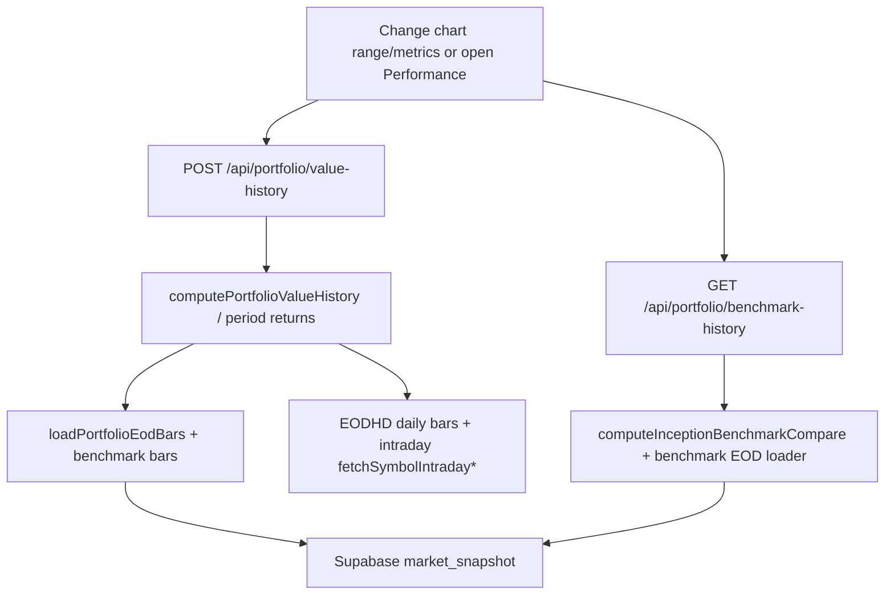

# Backend Architecture Performance Audit (Steps 1–5)

This doc consolidates the audit’s **Steps 1–5** into a single production-ready plan format:

- Major data flows and duplication hotspots
- Reusable datasets (asset-centric view)
- Evidence-based optimization opportunities
- Ranked priorities (requests / latency / provider cost)
- A 2-week ROI roadmap (plus a 1-week “rush” variant)

Constraints:

- **Read-only audit** (no code changes in this doc)
- Preserve **UX**, **API contracts**, **data correctness**, and **existing response times**

---

## Step 1) Major data flows + duplication hotspots

### 1. Portfolio Overview

```mermaid
flowchart TD
  A[User opens portfolio Overview tab] --> B[POST /api/portfolio/overview-market]
  A --> C[POST /api/portfolio/analytics]
  A --> D[POST /api/portfolio/value-history (overview chart/perf)]
  B --> E[getPortfolioOverviewMarketPayload]
  C --> F[computePortfolioAnalyticsSnapshot]
  D --> G[computePortfolioValueHistory]
  E --> H[Client sessionStorage cache + server unstable_cache + Supabase slow snapshots]
  F --> I[loadPortfolioEodBars (unstable_cache + inflight dedupe)]
  G --> J[loadPortfolioEodBars (unstable_cache + inflight dedupe)]
  H --> K[Supabase market_snapshot]
  I --> K
  J --> K
  E --> L[EODHD fundamentals/open-price + FRED + Shiller]
  G --> M[EODHD daily bars + intraday paths]
```

Duplication hotspots:
- Overview chart vs performance/other portfolio surfaces both call `POST /api/portfolio/value-history`.
- `portfolio-overview-cards` and `portfolio-overview-metrics` both do overlapping fundamentals/work over the same holdings universe (even though the underlying fundamentals loader is cached).

---

### 2. Portfolio Analytics

```mermaid
flowchart TD
  A[Portfolio page loads Key Stats] --> B[POST /api/portfolio/analytics]
  B --> C[computePortfolioAnalyticsSnapshot]
  C --> D[loadPortfolioEodBars + loadPortfolioBenchmarkEodBars]
  C --> E[fetchEodhdFundamentalsJson (cached)]
  D --> F[Supabase market_snapshot]
  D --> G[EODHD daily bars]
  E --> F
```

Duplication hotspots:
- Analytics reloads fundamentals + daily bars that overview/history likely already triggered during the same user session.
- No dedicated “computed snapshot cache” exists for `computePortfolioAnalyticsSnapshot()` at the route level.

---

### 3. Portfolio History



Duplication hotspots:
- Overview chart + performance panel independently call `POST /api/portfolio/value-history`.
- Benchmark overlays can be fetched from both overview and performance independently via `GET /api/portfolio/benchmark-history`.

---

### 4. Watchlist

```mermaid
flowchart TD
  A[Open watchlist] --> B[GET /api/watchlist]
  A --> C[POST /api/watchlist/enrich]
  C --> D[buildWatchlistEnrichedGroups (withScreenerUsMarketCache)]
  D --> E[readMarketSnapshot + rebuildMarketSnapshotBlobSingleFlight]
  E --> F[Supabase market_snapshot]
  D --> G[EODHD-backed quote/fundamentals via simple-market-layer]
  A --> H[Mutations (add/remove/reorder) -> refetch canonical snapshot]
```

Duplication hotspots:
- Page and rail both use enrichment hooks; multi-mount behavior can overlap enrichment work (client in-flight dedupe helps only when request keys/timing align).
- Post-mutation canonical refetch is intentional for correctness, but increases repeated Supabase reads.

---

### 5. Stock Page

```mermaid
flowchart TD
  A[Open /stock/[ticker]] --> B[SSR direct loadStockPageInitialData()]
  A --> C[/api/stocks/[ticker]/header-meta]
  A --> D[/api/stocks/[ticker]/chart]
  A --> E[/api/stocks/[ticker]/live-price]
  A --> F[/api/stocks/[ticker]/performance]
  A --> G[/api/stocks/[ticker]/news]
  A --> H[/api/stocks/[ticker]/key-stats-bundle]
  B --> I[market_snapshot + asset snapshot + single-flight cold miss]
  I --> J[Supabase market_snapshot]
  C/D/E/F/G/H --> K[EODHD fundamentals/daily bars/spot/realtime/news/profile]
```

Duplication hotspots (from the audit):
- SSR “initial blob” + client warmup endpoints overlap on first paint.
- Header/meta fundamentals and key-stats fundamentals are separate loaders, so identical ticker fundamentals can still be requested via different cache entries.

---

### 6. Search

```mermaid
flowchart TD
  A[Type in global search] --> B[/api/search]
  A --> C[globalAssetSearch + unstable_cache]
  C --> D[Supabase? (recent searches only)]
  B --> E[EODHD search for wider results]
  A --> F[local registries + top500 + crypto universe]
```

Duplication hotspots:
- Multiple client components can trigger identical search queries concurrently; server caching reduces provider cost but not necessarily request count.

---

### 7. Notifications

```mermaid
flowchart TD
  A[Topbar shows unread badge] --> B[useNotificationsClient refresh({full:false})]
  B --> C[GET /api/notifications?count=1]
  A[Open panel] --> D[notifications-panel-modal refresh({full:true})]
  D --> E[GET /api/notifications]
  C --> F[Supabase user_notifications + preferences]
  E --> F
  A[Mark read/delete] --> G[POST/PATCH/DELETE notification routes]
```

Duplication hotspots (code-provable):
- Polling count (`/api/notifications?count=1`) continues while the panel open triggers a full list fetch (`/api/notifications`).
- `lib/notifications/use-notifications-client.ts`: count polling via `/api/notifications?count=1`.
- `components/layout/notifications-panel-modal.tsx`: panel open triggers `refresh({ full: true })`.

---

### 8. Super Investors

```mermaid
flowchart TD
  A[Open /superinvestors list] --> B[/api/superinvestors/* transactions|performance + /api/stocks/[ticker]/superinvestors]
  B --> C[market_snapshot blobs + snapshot-only readpaths]
  C --> D[Supabase market_snapshot + superinvestor_follows]
  D --> E[SEC-derived sources only via cron/ops paths]
  A[Open profile] --> F[loadSuperinvestorProfilePageData (snapshot)]
```

Duplication hotspots:
- Multiple snapshot keys exist intentionally for low-latency list vs profile vs activity reads.

---

### 9. Macro

```mermaid
flowchart TD
  A[Open /macro] --> B[getMacroDashboardPayloadCached]
  B --> C[readHubSnapshot (market_snapshot)]
  B --> D[unstable_cache fallback rebuild -> fetchMacroSeriesAll]
  D --> E[FRED + BLS + Shiller + EODHD macro endpoints]
  C --> F[Supabase market_snapshot]
```

Duplication hotspots:
- Only on snapshot miss/staleness: fallback rebuild re-orchestrates many series.

---

### 10. Screener

```mermaid
flowchart TD
  A[Open screener] --> B[Market tab routes: /api/screener/*]
  A --> C[Client MarketsSection uses session cache + fetches subpages]
  C --> D[market_snapshot blobs + simple-market-layer]
  D --> E[Supabase market_snapshot (screener snapshots)]
  D --> F[EODHD-backed quote/fundamentals/realtime]
  A[Select key-stat metrics] --> G[POST /api/screener/companies-key-stat]
  G --> H[unstable_cache per (metricId, tickersKey)]
  H --> I[fetchKeyStatCellForTicker on cache misses]
```

Duplication hotspots (code-provable):
- Extra crypto movers warmup fetches `/api/screener/crypto-rows?page=1&pageSize=50` (and later pagination fetches).
- Key-stat metric selection fans out into one POST per selected `metricId`.

---

## Step 2) Reusable datasets (asset-centric)

### Fundamentals (EODHD fundamentals root)
- Used by: Stock page (header/key-stats), Portfolio overview + analytics, Watchlist off-universe enrichment, Screener key-stat cells.
- Code paths:
  - `lib/market/eodhd-fundamentals.ts` (`fetchEodhdFundamentalsJson` cached)
  - `lib/market/stock-key-stats-bundle.ts` (bundle-backed metrics)
  - `lib/market/watchlist-enrichment.ts` + `lib/market/simple-market-layer.ts`
  - `app/api/screener/companies-key-stat/route.ts` uses `fetchKeyStatCellForTicker(...)` on misses
- Identical upstream requests can still happen because different loaders request overlapping ticker sets with different cache keys/flags, and “computed bundle/snapshot” layers aren’t always shared across whole-page loads.

### Quote / realtime marks
- Used by: Stock page live-price + charting; Watchlist market slices.
- Code paths: `lib/market/simple-market-layer.ts` and stock endpoints like `/api/stocks/[ticker]/live-price`.

### Daily bars (EODHD daily)
- Used by: Portfolio analytics/history, Screener derived metrics, Stock page charts, Superinvestor performance reconstruction.
- Code paths:
  - Portfolio: `lib/portfolio/data/load-portfolio-eod-bars.ts` (strong dedupe)
  - Screener: `getCachedScreenerEodBarsForTickers()` via simple-market-layer

### Minute bars / intraday bars
- Used by: Portfolio history intraday construction.
- Code paths: `lib/portfolio/portfolio-value-history.server.ts` (intraday helpers).
- Identical upstream requests can still happen because overview/performance components independently call `value-history`, and intraday fetches aren’t centralized into one shared “final series” cache.

### News (EODHD news)
- Used by: Stock page overview SSR and the stock news tab.

### Macro series (FRED/BLS/Shiller/EODHD macro)
- Used by: Macro page.

### Risk-free rate (Fed Funds)
- Used by: Portfolio analytics risk metrics.

### Benchmark data (SPY/QQQ daily bars)
- Used by: Portfolio compare overlays and benchmark history.

---

## Step 3) Evidence-based optimization opportunities

### 1) Stop duplicate notifications fetch on panel open
- Problem: polling count continues while panel open triggers full refresh.
- Evidence:
  - `lib/notifications/use-notifications-client.ts`: `/api/notifications?count=1`
  - `components/layout/notifications-panel-modal.tsx`: `refresh({ full: true })`
- Expected reduction: fewer notifications requests during open transitions.
- Complexity: S
- Regression risk: Low
- Concrete paths: the two files above.

### 2) Batch Screener key-stat metric requests
- Problem: selecting multiple metrics issues one POST per `metricId`.
- Evidence:
  - `components/screener/markets-section.tsx`: `companiesKeyStatMetricIds.map(...)` calling `/api/screener/companies-key-stat`.
  - `app/api/screener/companies-key-stat/route.ts`: caches per `(metricId, tickersKey)` and runs `fetchKeyStatCellForTicker(...)` on cache misses.
- Expected reduction: request fanout reduced from N to 1; improves cache effectiveness and reduces server work.
- Complexity: M

### 3) Share computed Portfolio history series between overview chart and performance panel
- Problem: both components call `POST /api/portfolio/value-history` independently.
- Evidence: both surfaces hit the same route; `value-history` avoids `unstable_cache`, so computed series aren’t reused across components.
- Expected reduction: fewer computed-history recomputations; underlying bars already dedupe, but computed payload duplication remains.
- Complexity: M

### 4) Reduce Watchlist enrichment rework across simultaneous mounts
- Problem: page and rail both use enrichment hooks; multi-mount behavior can overlap enrichment work.
- Evidence (representative):
  - `lib/watchlist/use-watchlist-enriched-items.ts` and `lib/watchlist/fetch-watchlist-enriched.ts` (client caching and in-flight dedupe)
  - `lib/market/watchlist-enrichment.ts` and `lib/screener/screener-us-market-cache.ts` (server snapshot stack)
- Expected reduction: fewer repeated enrichment requests and Supabase reads.
- Complexity: M

### 5) Screener crypto movers warmup: skip redundant universe fetch
- Problem: the crypto movers UI triggers an extra `/api/screener/crypto-rows?page=1&pageSize=50` warmup even when the client already has enough data to compute movers.
- Evidence (code-provable):
  - `components/screener/markets-section.tsx` calls `fetch("/api/screener/crypto-rows?page=1&pageSize=50", ...)` in `CryptoTabBody` (gainers/losers derivation).
- Expected reduction:
  - External provider requests: **small / indirect** (depends on snapshot/cache miss rate)
  - Supabase queries: **modest** reduction on crypto tab opens
  - Duplicate work: moderate reduction in early crypto tab concurrency
- Complexity: S

---

## Step 4) Ranked optimizations (ROI-oriented)

### Table 1: Highest request count drivers (most likely)
1. `GET /api/notifications?count=1` (60s poll)
2. `POST /api/portfolio/value-history` (overview + performance + retries)
3. `GET /api/portfolio/benchmark-history` (overview + performance overlays)
4. `POST /api/screener/companies-key-stat` (N metricIds fanout)
5. `GET /api/screener/crypto-rows?...page=1&pageSize=50` (movers warmup)

### Table 2: Highest latency contributors (most likely)
1. Portfolio `value-history` computed series (intraday work)
2. Portfolio overview slow snapshot fields
3. Screener key-stat cache-miss path (`fetchKeyStatCellForTicker`)
4. Notifications full list fetch on panel open
5. Stock page SSR initial fanout + client warmups

### Table 3: Highest external-provider cost (most likely)
1. Intraday EODHD in `portfolio-value-history.server.ts`
2. EODHD fundamentals fanout for computed metrics (portfolio + screener key-stat cells + watchlist enrichment)
3. EODHD daily bars (portfolio + charts + derived metrics)
4. EODHD macro endpoints (macro page rebuild)
5. EODHD news (stock overview + news tab)

---

## Step 5) 2-week implementation roadmap (sorted by ROI)

1. **Notifications panel open coalescing** (Critical / S / Low regression)
2. **Screener key-stat batching (`metricIds[]`)** (Critical / M / Medium regression)
3. **Portfolio computed history reuse (overview + performance)** (High / M / Medium regression)
4. **Watchlist enrichment mount/reuse improvements** (Medium / M / Low-medium regression)
5. **Screener crypto movers redundant warmup conditional skip** (Medium / S / Low-medium regression)

---

## 1-week “rush” plan (if onboarding thousands of users immediately)

Implement first (highest ROI / lowest risk):

1. Notifications panel open coalescing
2. Screener key-stat batching (`metricIds[]`)
3. Portfolio computed history reuse (overview + performance)

Deliberately postpone:

4. Watchlist enrichment mount/reuse improvements
5. Screener crypto movers redundant warmup conditional skip

---

## Implementation checklist (to-do + safety + ROI)

| Priority | To-do (optimization) | Safety risk (regression) | Complexity | Expected ROI | Confidence | Dependencies | Implement timing |
|---:|---|---|---|---|---|---|---|
| 1 | Coalesce notifications poll with panel open | Low | XS | Highest | High | None | Now |
| 2 | Batch Screener key-stat requests (metricIds[]) | Medium | M | High | Medium-High | Client + route contract update (backwards compatible) | Before launch |
| 3 | Reuse computed portfolio history between Overview and Performance | Medium | M | High | Medium | Correct cache key / invalidation signal for portfolio state | Before launch |
| 4 | Reuse watchlist enrichment payload across multi-mount cases | Low-Medium | M | Medium | Medium | Validate dedupe key normalization and invalidation after mutations | After launch |
| 5 | Skip redundant crypto movers universe warmup when already sufficient | Low-Medium | S | Medium-Low | Medium | Ensure movers UI still renders correctly for all payload states | After launch |

