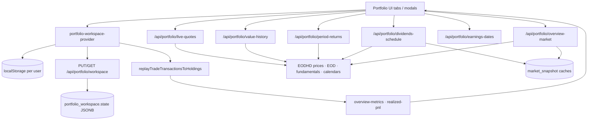

# PORTFOLIO MODULE — PHASE 0 SYSTEM AUDIT

**Date:** 2026-07-21  
**Scope:** Manual Portfolio only (create / edit / delete, transactions, valuation, returns, charts, dividends, earnings, allocation, cash)  
**Mode:** Audit & evidence only — **no code changes**, no UI redesign  
**Explicitly excluded:** Brokerage connect, SnapTrade sync, CSV/spreadsheet import productization as a data source of truth  

---

## Executive summary

Manual Portfolio is a **client-led document store**, not a normalized ledger database:

1. User mutates transactions in the browser (`portfolio-workspace-provider`).
2. State is written to **localStorage** and synced via `PUT /api/portfolio/workspace` into a single JSON blob per user (`portfolio_workspace.state`).
3. Holdings are **recomputed by replaying trades** (average-cost), not stored as authoritative rows.
4. Market marks, charts, dividends, and earnings come from **on-demand `/api/portfolio/*` routes** backed by **EODHD** (USD-only).

**Production readiness (Manual):** usable for basic buy/sell/cash tracking with average-cost P/L, but **not** yet trustworthy for flow-adjusted performance, risk metrics, or apples-to-oranges benchmark claims.

| Area | Verdict |
|------|---------|
| Transaction → cash / qty / avg-cost math | **Mostly sound** (average cost) |
| Lifetime equity P/L vs open lots | **Internally consistent** when replay order is stable |
| Deposits / withdrawals vs return % | **Broken / misleading** on period NW returns & overview period cards |
| Key Stats (Sharpe, Sortino, beta, …) | **Placeholder / fake numbers** |
| “Ahead on X%” vs SPY | **Methodologically inconsistent** |
| Historical chart | **Replay + mark-to-market** (no stored NAV snapshots); flow-naïve |
| Security / RLS | **Sound for workspace ownership** |
| Multi-currency / FX | **Not supported** (USD-only) |
| Same-day trade ordering | **Unstable** (Critical for correctness) |

---

## 1. Architecture diagram



### User action → UI path

| Step | Component / route |
|------|-------------------|
| Create / rename / delete portfolio | `portfolio-workspace-provider` → local state → debounced `PUT /api/portfolio/workspace` |
| Buy / Sell / Income / Expense | `new-transaction-modal` / `edit-transaction-modal` |
| Cash In / Out | `add-cash-modal` |
| View overview metrics | `portfolio-overview-cards` + `overview-metrics.ts` |
| Chart | `portfolio-overview-chart` → `POST /api/portfolio/value-history` |
| Period bars | `POST /api/portfolio/period-returns` |
| Dividends tab | `POST /api/portfolio/dividends-schedule` |
| Earnings tab | `POST /api/portfolio/earnings-dates` |
| Live marks | `POST /api/portfolio/live-quotes` |

### Routes inventory (Manual-relevant)

| Kind | Path |
|------|------|
| Page | `/portfolio` |
| API | `/api/portfolio/workspace`, `live-quotes`, `value-history`, `period-returns`, `overview-market`, `dividends-schedule`, `earnings-dates`, `header-meta` |
| Supporting | `/api/stocks/[ticker]/price-on-date` |
| Public (optional) | `/portfolios`, `/api/portfolios/listings*` |

**Server actions:** none for portfolio ledger.  
**Crons:** none dedicated to Manual Portfolio. Indirect: `market-snapshots`, `earnings-notifications` (universe may include holdings).  
**Workers:** none for portfolio NAV.

### Market-data dependencies

| Data | Provider | Notes |
|------|----------|-------|
| Live stock/crypto marks | EODHD realtime / crypto live | USD |
| Historical EOD / intraday | EODHD | Charts + period returns |
| Benchmark | **SPY** (hardcoded) | Price path, not total-return index |
| Dividends | EODHD calendar + history + fundamentals yield | |
| Earnings | Stock header meta / earnings countdown | ETF/crypto → N/A |
| FX | **None** | USD-only cash (`USD`) |

---

## 2. Data model audit

### Tables

#### `portfolio_workspace`

| Field | Role |
|-------|------|
| `user_id` (PK) | Owner; `REFERENCES auth.users ON DELETE CASCADE` |
| `state` (jsonb) | Entire workspace: portfolios, holdings maps, transactions maps |
| `updated_at` | Last sync |

**RLS:** `auth.uid() = user_id` for ALL.  
**Indexes:** PK on `user_id` only.  
**Soft delete:** none — deleting a portfolio removes it from JSON; user delete cascades row.

**JSON shape (authoritative ledger):**

- `portfolios[]` — id, name, visibility, optional `snaptrade` (exclude from Manual), optional `combinedFrom`
- `holdingsByPortfolioId[id][]` — **derived cache** for UI; rebuilt from trades
- `transactionsByPortfolioId[id][]` — **source of truth** for cash + positions

There are **no** normalized `transactions` / `holdings` / `portfolios` tables.

#### `public_portfolio_listings`

Community snapshots when a portfolio is Public (`metrics` jsonb).  
**RLS:** any authenticated user can SELECT; owners INSERT/UPDATE/DELETE own rows.

#### Shared

`market_snapshot` — caches dividend inputs / yield / inception opens (`portfolio_*_v1` keys), not portfolio NAV history.

### Capabilities vs model

| Requirement | Supported? | Notes |
|-------------|------------|-------|
| Multiple portfolios / user | Yes | Array in JSON |
| Multiple currencies | **No** | USD-only |
| Fractional shares / crypto | Yes | JS `number` |
| Stock splits | Partial | `operation: Split` + ratio helpers |
| Ticker changes / delisting | Weak | Symbol string only; no corporate-action registry |
| Duplicate tickers / exchanges | Weak | Symbol uppercase match; crypto via `-USD` / route helpers |
| Fees / income / expense | Yes | Separate kinds + trade `fee` |
| Partial / full sells | Yes | Avg-cost pro-rata; oversell capped silently |
| Out-of-order dates | Partial | Sorted by `date` only |
| Edit / delete historical tx | Yes | Client mutates array → replay |
| Quantity / price precision | JS float | No fixed decimal type |

---

## 3. Transaction engine & calculation matrix

**Cash balance** = `Σ transaction.sum` (`netCashUsd`).  
**Positions** = replay of `kind === "trade"` only (`Buy` / `Sell` / `Split`).

| Operation | `kind` | Typical `sum` | Cash | Quantity | Cost basis | Realized | Notes |
|-----------|--------|---------------|------|----------|------------|----------|-------|
| Buy | `trade` | `-(qty×px + fee)` | ↓ | ↑ | ↑ by lot cost | — | Fee capitalized into cost |
| Sell | `trade` | `+(qty×px − fee)` (≥0) | ↑ | ↓ | ↓ pro-rata avg | `sum − costRemoved` | Fee reduces proceeds |
| Split | `trade` | `0` | — | × ratio | unchanged | — | Avg/market ÷ ratio |
| Cash In | `cash` | `+amount` | ↑ | — | — | — | |
| Cash Out | `cash` | `−amount` | ↓ | — | — | — | |
| Other income (cash modal) | `cash` | `+` | ↑ | — | — | — | |
| Other expense (cash modal) | `cash` | `−` | ↓ | — | — | — | |
| Dividend / income tab | `income` | `+(perShare×shares − fee)` | ↑ | — | — | — | Does **not** change cost |
| Expense / Fees tab | `expense` | `−amount` | ↓ | — | — | — | Distinct from trade `fee` |

**Sign convention:** `sum` negative = cash out; positive = cash in (`portfolio-types.ts`).

**Portfolio value / profit (headline):**

| Metric | Definition in code |
|--------|-------------------|
| Net worth | `Σ currentValue + cash` |
| Invested (subtitle) | **Open** `Σ costBasis` only |
| Unrealized $ | `Σ (MV − costBasis)` |
| Realized $ | Cumulative sell `sum − avg-cost removed` |
| Lifetime equity $ | unrealized + realized |
| Lifetime equity % | lifetime $ / **historical** equity cost (open + cost of sold) |

Dividends / cash income **increase cash and net worth** but are **not** included in “lifetime equity profit %” denominator or numerator (equity-trading P/L only).

---

## 4. Cost basis

**Method: weighted average cost (not FIFO / LIFO / SpecID).**

Evidence: `mergeBuyIntoPosition` in `lib/portfolio/holding-position.ts` — `newAvgPrice = newCostBasis / newShares`; fee included in lot cost.

On sell: `costRemoved = (sold/held) × costBasis` (`realized-pnl-from-trades.ts`).

| Scenario | Behavior |
|----------|----------|
| Multiple buys different prices | Pooled average |
| Partial sell | Pro-rata average cost |
| Full sell | Position removed; realized = proceeds − full cost |
| Sell then rebuy | New lot starts fresh average |
| Fees on buy | In cost basis |
| Fees on sell | Reduce `sum` (proceeds), not cost |
| Fractional / crypto | Same formulas |
| Retroactive insert | Re-sorted by date; same-day order undefined |

**Realized + unrealized reconciliation:**  
`lifetimeEquityProfitUsd = unrealized + cumulativeRealizedGainUsd` — consistent with the same replay path **if** sort order is deterministic.

---

## 5. Portfolio value — definition clarity

| Term | Finsepa meaning | Ambiguity |
|------|-----------------|-----------|
| Portfolio / net worth | Cash + MTM holdings | Clear |
| Invested | Open cost basis | **Not** net deposits |
| Net deposits | Not a first-class metric | Cash In/Out exist in ledger only |
| Purchase cost / cost basis | Avg-cost of open lots | Clear |
| Current value | Shares × live/last mark | Depends on quote freshness |
| Realized / unrealized | Equity trades only | Cash income excluded from equity P/L |
| Dividends / fees / expenses | Cash ledger | Affect NW; not equity ROC |

**Identity check:**  
`Portfolio value = cash + Σ asset MV` — **yes** (`totalNetWorth`).

**“Total profit = portfolio value − net contributed capital”** — **not** how Finsepa defines lifetime equity profit. Lifetime equity profit ignores net deposits and uses historical equity cost instead.

---

## 6. Return calculations

| Surface | Method | Flow-adjusted? |
|---------|--------|----------------|
| All-time % (overview) | Simple ROC: equity P/L / historical equity cost | N/A (not TWR/MWR) |
| Overview 1M / YTD / 1Y / 5Y | **Value-weighted average of per-ticker price %** | **No** — ignores cash & trades in window |
| Chart `returnPct` | Same lifetime-style equity % as-of sample date | Partial (as-of replay) |
| Period bars (W/M/Q/Y) | `(V1/V0 − 1)×100` on net worth | **No** — deposits inflate, withdrawals deflate |
| Modified Dietz | Implemented in `benchmark-inception.ts` | **Dead code — never called** |
| TWR / IRR / XIRR | — | **Not implemented** |

### Deposit / withdrawal impact (evidence from deterministic scenarios)

| Scenario | Equity lifetime % | Naive NW `V1/V0` | Modified Dietz (unused) |
|----------|-------------------|------------------|-------------------------|
| C: flat stock + $5k deposit | **0%** | **+500%** | **0%** |
| D: flat stock + $2k withdrawal | **0%** | **−20%** | **0%** |

**Finding (Critical):** Period net-worth returns and any UI that uses `V1/V0` **treat deposits as performance** and **withdrawals as losses**. Overview period cards use a different wrong method (price-weighted holdings returns).

Ranges present: chart `1d|7d|1m|6m|ytd|1y|5y|all`; overview profit periods `all|m1|ytd|y1|y5` (no dedicated 1D/7D profit cards).

---

## 7. Historical portfolio chart

**Pipeline:** `computePortfolioValueHistory`  
→ for each sample date: `replayTradeTransactionsToHoldingsUpTo` + last EOD/intraday close × shares + `netCashUsdUpTo`  
→ `{ t, value, profit, returnPct }`.

| Property | Status |
|----------|--------|
| Stored daily NAV snapshots | **No** |
| Holdings × historical prices | **Yes** (hybrid with cash ledger) |
| Future knowledge | Avoided via as-of replay + last close ≤ date |
| Weekends / holidays | Last close on or before; calendar sampling for some ranges |
| Crypto 24/7 | Crypto daily bars; YTD uses intraday samples for stocks |
| Tx edits | Rebuild on next API call (client sends full tx list) |
| Caps | `MAX_TX = 4000`; max points ~12–80 by range |
| Flat / jumps | Expected on cash flows (not flow-normalized); subsampled ranges can look stepped |

---

## 8. Benchmark comparison

| Aspect | Implementation |
|--------|----------------|
| Symbol | **SPY** |
| Source | EODHD / stock performance APIs |
| Total vs price return | **Price** (no dividend reinvestment in SPY path) |
| “Ahead on X%” | `lifetimeEquityProfitPct − (SPY_now/SPY_inceptionOpen − 1)×100` |
| Inception | Earliest **stock buy** date |
| Chart overlay | Scale notional (open equity cost) by SPY path |
| Period bars | Same d0/d1 simple SPY % |

**Finding (High):** “Ahead on X%” compares **equity average-cost ROC** to **buy-and-hold SPY price %** from first buy — different bases, cash ignored, dividends asymmetric. Not a valid outperformance claim without redefinition.

---

## 9. Performance metrics (Key Stats)

**Finding (Critical):** `PortfolioOverviewMetrics` renders **hardcoded `PLACEHOLDER_METRICS`** (e.g. P/E 18.4, Sharpe 1.12, Sortino 1.45, …) whenever the portfolio is non-empty. Empty portfolios show zeros.

| Metric | Computed? | Formula / window / weighting |
|--------|-----------|------------------------------|
| P/E, margins, ROCE, cash conversion | **No** | Placeholders |
| Sharpe, Sortino, volatility, beta, turnover | **No** | Placeholders |
| S&P comparison styling | Cosmetic | Uses placeholder benchmark nums |

No portfolio-weighted fundamentals pipeline exists for these cards.

---

## 10. Dividends

| Feature | Behavior |
|---------|----------|
| Booked dividends | `kind: income` → cash only |
| Yield card | Value-weighted trailing yield from fundamentals; annual $ ≈ MV × yield |
| Schedule | EODHD calendar + history; future dates via **median gap**; `declared` vs `estimated` |
| Share count | **Current** holdings shares × per-share |
| Ex-date / sold shares | Not modeled for accrual; projection ignores record-date holdings |
| Currency / withholding | USD assumptions; no withholding model |
| Crypto | Skipped |

Projected income is an **estimate**, not linked to ledger dividend rows.

---

## 11. Earnings

| Aspect | Behavior |
|--------|----------|
| API | `POST /api/portfolio/earnings-dates` (auth required) |
| Source | `getStockHeaderEarningsLineForTicker` / identity |
| ETF / crypto | `notApplicable: true` |
| Days left | `earningsDaysLeftFromYmd` |
| Confirmed vs estimated | Depends on header meta fields |
| Stale / weekend | Inherited from stock header pipeline |

---

## 12. Allocation and slices

`buildPortfolioAllocationRows`:

- `denom = equityMV + max(0, cash)`
- Weights = MV / denom; cash slice only if cash > 0
- Top N + Other (`allocation-donut-rows`)

| Issue | Severity |
|-------|----------|
| Negative cash omitted from denom / slices | Medium — NW includes it; allocation does not |
| Unknown sector / custom assets | Depends on display helpers; may bucket poorly |
| Slice gain | Unrealized only (MV − cost) |

---

## 13. Cash

| Check | Result |
|-------|--------|
| Single ledger sum | Yes — all kinds contribute to `sum` |
| Cash tab vs overview cash | Same `netCashUsd` if same tx list |
| Allocation vs NW | Diverges when cash &lt; 0 |
| Multi-currency | No |
| Trade cash + dividends + fees | All via `sum` |

---

## 14. Data freshness map

| Data | Provider | Refresh | Cache | Stale behavior |
|------|----------|---------|-------|----------------|
| Workspace JSON | Supabase | On user edit (debounced PUT) | localStorage + DB | Last-write wins per user |
| Live quotes | EODHD | On demand | Route / Next cache (`portfolio-live-quotes-v1`) | Last successful mark |
| Chart history | EODHD EOD/intraday | On demand per request | Request-scoped | Missing symbol → incomplete MV |
| Period returns | EODHD | On demand | — | Null bars if dates missing |
| Overview market / yields | EODHD + `market_snapshot` | On demand + snapshot TTL | `portfolio_overview_slow_v1` | Snapshot fallback |
| Dividend schedule inputs | EODHD + snapshot | On demand | `portfolio_dividends_inputs_v1` | Estimated forward |
| Earnings | Header meta | On demand | Stock caches | N/A for ETF/crypto |

Portfolio pages **do** trigger external calls (quotes, history, dividends, earnings) rather than reading a precomputed portfolio NAV snapshot.

---

## 15. Performance report (code-level; no live authenticated profiling in this phase)

| Concern | Evidence |
|---------|----------|
| SSR | `/portfolio` is client-heavy; workspace hydrate from GET + localStorage |
| Chart | Server recomputes full series from tx + multi-symbol EOD (`Promise.all` per symbol) |
| Period returns | Similar multi-symbol EOD fetch |
| Overview market | Parallel per-symbol performance + yield fetches |
| Fan-out | Client may call live-quotes, overview-market, value-history, period-returns, dividends, earnings separately |
| Payload | Full transaction list posted to history/returns APIs (`MAX_TX` 4000) |
| N+1 risk | Display-name / header-meta per symbol in some hooks |
| Recalc | Any tx edit invalidates derived holdings; history always rebuilt |

**Risk:** Large Manual portfolios (thousands of txs, many symbols) → slow chart/period endpoints and large JSON PUT bodies.

---

## 16. Security and user isolation

| Control | Status |
|---------|--------|
| RLS on `portfolio_workspace` | Yes — own row only |
| RLS on `public_portfolio_listings` | Read all authenticated; write own |
| Workspace API auth | `requireAuthUser`; upsert keyed by `user.id` |
| Trust client portfolio IDs | IDs live inside user-owned JSON — cannot read another user’s blob via RLS |
| Service role | Not used on workspace route (user-scoped server client) |
| Deleted users | `ON DELETE CASCADE` on workspace |
| Public listings | Intentional exposure of metrics snapshot when Public |

**Gap (Medium):** PUT accepts entire state blob with schema parse only — no server-side semantic validation (negative shares, impossible sells). Integrity is client-enforced.

**Gap (Low):** Public listing metrics could lag or be stale relative to private workspace.

---

## 17. Deterministic test scenarios

Independent mirror of Finsepa average-cost + cash ledger (same formulas as `holding-position` / `realized-pnl` / `overview-metrics`). **Expected Finsepa results** if UI uses those helpers:

### A — Simple stock + price up

Cash In 10 000; Buy 10 @ 100; mark 120.

| Metric | Expected |
|--------|----------|
| Cash | 9 000 |
| NW | 10 200 |
| Open cost | 1 000 |
| Lifetime $ / % | 200 / **20%** |

### B — Two buys + partial sell

Buys 10@100 + 10@200; sell 10@180; mark 180.

| Metric | Expected |
|--------|----------|
| Avg after buys | 150 |
| Realized | 300 |
| Open cost / shares | 1 500 / 10 |
| Unrealized | 300 |
| Lifetime $ / % | 600 / **20%** |

### C — Deposit during flat performance

Buy 10@100; Cash In +5 000; price flat.

| Metric | Expected |
|--------|----------|
| Lifetime equity % | **0%** (correct for equity ROC) |
| Period NW `V1/V0` | **+500%** (incorrect as “return”) |
| Dietz (unused) | **0%** |

### D — Withdrawal

Cash Out −2 000; price flat.

| Lifetime equity % | **0%** |
| Naive NW return | **−20%** |
| Dietz (unused) | **0%** |

### E — Dividend + fee expense

Buy 10@100 fee 5; dividend +10; expense −2; mark 100.

| Cash | 4 003 |
| Open cost | 1 005 |
| Lifetime equity $ | **−5** (unrealized only; dividend not in equity P/L) |

### F — Crypto fractional

Buy 0.015 BTC @ 60 000 fee 1; mark 70 000.

| Cost | 901 | MV | 1 050 | Lifetime % | **~16.54%** |

### G — Mixed stock / ETF / crypto / cash

AAPL/SPY/ETH as in script; cash remainder 16 600; lifetime **~$220 (~6.47%)**.

### H — Historical / ordering

| Case | Result |
|------|--------|
| Buy 2024-01-05 then sell 2024-01-10 (entered out of list order) | Correct after date sort: 5 sh left, realized 50 |
| **Same-day** Buy then Sell in array order | Fully exited, realized 100 |
| **Same-day** Sell then Buy in array order | Orphan sell skipped; **10 sh remain**, realized 0 — **different books** |

### I — Delete sell

Only buy remains → equivalent to A-style open lot.

### J — Full exit + rebuy

Sell all @150 (realized 500); rebuy 5@140; mark 160 → open cost 700, unr 100, lifetime **600 (~35.29% on hist cost 1 700)**.

---

## 18. Bugs and discrepancies

| ID | Severity | Issue | Evidence | Affected UI | Root cause | Recommended fix | Regression risk |
|----|----------|-------|----------|-------------|------------|-----------------|-----------------|
| P0-01 | **Critical** | Same-day trades have undefined order | `sort` returns `0` when dates equal | Holdings, P/L, chart | No secondary sort key | Stable sort: date → createdAt/id → buy-before-sell policy | Medium — changes historical P/L for ambiguous days |
| P0-02 | **Critical** | Period NW returns treat deposits/withdrawals as performance | `portfolioPct = V1/V0 − 1`; scenarios C/D | Performance period bars | No flow adjustment; Dietz unused | Wire Modified Dietz or TWR; exclude external flows | High — changes displayed period % |
| P0-03 | **Critical** | Key Stats are placeholders | `PLACEHOLDER_METRICS` | Overview metrics grid | Never implemented | Compute or hide until real | Low if hidden; High if wrong formulas rushed |
| P0-04 | **High** | Overview period profit = weighted ticker returns | `weightedPortfolioReturn` | Overview cards 1M/YTD/1Y/5Y | Not portfolio cash-flow return | Use same flow-aware method as chart/bars | High |
| P0-05 | **High** | “Ahead on X%” apples-to-oranges | lifetime equity ROC vs SPY price from first buy | Overview benchmark copy | Mixed definitions | Define comparable series (e.g. Dietz vs SPY total return) or relabel | Medium |
| P0-06 | **High** | Silent oversell / orphan sell | `Math.min`; skip sell if no holding | Positions understated risk | No validation errors | Reject invalid txs server+client | Medium |
| P0-07 | **Medium** | Negative cash excluded from allocation | `max(0, cash)` | Allocation ≠ NW | Denom design | Include signed cash or show warning | Low |
| P0-08 | **Medium** | Dividend projections ≠ ledger | Schedule uses current shares × EODHD | Dividends tab vs Cash | Separate pipelines | Label estimates; optional reconcile | Low |
| P0-09 | **Medium** | No multi-currency / FX | USD-only | All cash/value | Product scope | Document; future FX phase | — |
| P0-10 | **Medium** | Full tx blob on every chart request | POST body up to 4000 txs | Latency | No server-side ledger | Server-owned ledger or snapshots | High (arch) |
| P0-11 | **Medium** | `profitAllPct` computed as unrealized but All-time shows lifetime | overview-cards | Confusion / dead code | Leftover variable | Clean up | Low |
| P0-12 | **Low** | Import vs UI dividend shapes differ | Import drafts | Import path (excluded product) | Dual writers | Align if import enabled | Medium |
| P0-13 | **Low** | Combined / brokerage share same JSON | `snaptrade` flag | Isolation of Manual audit | Overlay design | Keep Manual paths free of SnapTrade assumptions | — |

---

## 19. Risk ranking

1. **Critical — Misleading performance** (P0-02, P0-04, P0-03)  
2. **Critical — Non-deterministic same-day ledger** (P0-01)  
3. **High — Benchmark claims** (P0-05)  
4. **High — Invalid trade acceptance** (P0-06)  
5. **Medium — Scale / architecture** (JSON blob, client authority, P0-10)  
6. **Medium — Allocation / dividend estimate clarity** (P0-07, P0-08)  
7. **Low — Polish / dead code / import shapes**

---

## 20. Recommended implementation phases

| Phase | Focus | Outcome |
|-------|-------|---------|
| **1 — Correctness hard gates** | Stable trade ordering; reject orphan/oversell sells; hide or compute Key Stats; stop showing placeholder Sharpe/etc. | No silent wrong books; no fake risk metrics |
| **2 — Return methodology** | Adopt Modified Dietz or TWR for period bars + overview periods; use Dietz helper already in repo; document formulas in UI tooltips | Deposits/withdrawals no longer look like alpha/loss |
| **3 — Benchmark parity** | Single comparable portfolio vs SPY (same flow treatment; prefer total-return benchmark if available) | “Ahead” claim becomes defensible |
| **4 — Valuation robustness** | Quote freshness badges; weekend/holiday policy docs; negative-cash allocation; dividend estimate labeling | User trust in numbers |
| **5 — Architecture hardening** | Optional normalized tx table or server-side replay cache; NAV snapshots for charts; payload limits; audit log | Scale + edit safety |
| **6 — Advanced** | Multi-currency, corporate actions registry, tax lots / FIFO option, brokerage (separate track) | Beyond Manual Phase 0 scope |

---

## 21. Calculation definitions (quick reference)

```
cash                 = Σ sum
holding_i            = replay(Buys, Sells, Splits)_i   // average cost
MV_i                 = shares_i × mark_i
net_worth            = Σ MV_i + cash
open_cost            = Σ costBasis_i
unrealized           = Σ (MV_i − costBasis_i)
realized             = Σ_sells (sum_sell − avg_cost_removed)
lifetime_equity_$    = unrealized + realized
lifetime_equity_%    = lifetime_equity_$ / (open_cost + cost_of_sold)
period_NW_% (today)  = V_end / V_start − 1          // NOT flow-aware
overview_period_%    = Σ (MV_i × ticker_return_i) / Σ MV_i
ahead_% (today)      = lifetime_equity_% − SPY_price_%_since_first_buy
```

---

## 22. Key file index

| Concern | Path |
|---------|------|
| Types / ledger shape | `components/portfolio/portfolio-types.ts` |
| Workspace sync | `components/portfolio/portfolio-workspace-provider.tsx`, `app/api/portfolio/workspace/route.ts` |
| Avg cost | `lib/portfolio/holding-position.ts` |
| Replay / holdings | `lib/portfolio/rebuild-holdings-from-trades.ts` |
| Realized P/L | `lib/portfolio/realized-pnl-from-trades.ts` |
| NW / ROC | `lib/portfolio/overview-metrics.ts` |
| Chart history | `lib/portfolio/portfolio-value-history.server.ts` |
| Period returns | `lib/portfolio/portfolio-period-returns.server.ts` |
| Dietz (unused) | `lib/portfolio/benchmark-inception.ts` |
| Allocation | `lib/portfolio/portfolio-allocation-rows.ts` |
| Placeholder metrics | `components/portfolio/portfolio-overview-metrics.tsx` |
| Overview cards / Ahead | `components/portfolio/portfolio-overview-cards.tsx` |
| Schema / RLS | `supabase/migrations/20260407140000_watchlist_table_and_portfolio_workspace.sql` |

---

## 23. Confidence

| Claim | Confidence |
|-------|------------|
| Architecture & data model map | **High** (code + migrations) |
| Average-cost + cash matrix | **High** |
| Period returns / Dietz unused / placeholders | **High** |
| Deterministic scenario numerics | **High** (formula mirror; not run through live UI) |
| Live latency / TTFB numbers | **Low** (code-path analysis only; no authenticated prod profiling this phase) |
| Earnings field nuance (confirmed vs estimate) | **Medium** (depends on header-meta payloads) |

---

**End of Phase 0.** Next step requires an explicit decision to enter Phase 1 (correctness gates) — no production behavior was changed in this audit.
