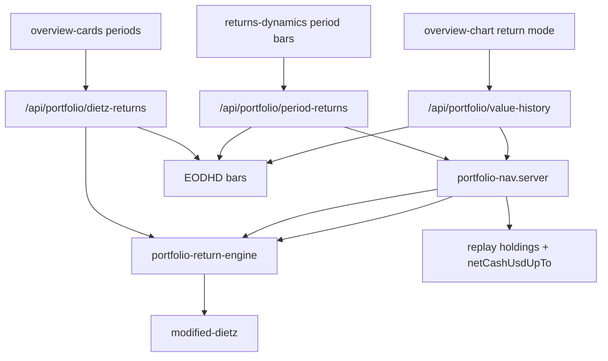

# PORTFOLIO MODULE — PHASE 2 RETURN METHODOLOGY

**Date:** 2026-07-21  
**Scope:** Manual Portfolio return % only (Modified Dietz)  
**Mode:** Calculation replacement — **no UI redesign**, no layout/nav/card/chart visual changes, no brokerage/import, no benchmark redesign, no new analytics  
**Ledger:** Phase 1 values unchanged (cash, holdings, cost basis, realized/unrealized $)

---

## Final verdict: **PASS**

| Gate | Result |
|------|--------|
| Single return engine | PASS — `lib/portfolio/returns/` |
| Modified Dietz validated + promoted | PASS — day-weighted; midpoint kept for comparison |
| Period bars flow-aware | PASS — replaces `V1/V0` |
| Overview period cards flow-aware | PASS — `/api/portfolio/dietz-returns` |
| Chart `returnPct` flow-aware | PASS — Dietz from inception; value/profit series unchanged |
| Ledger $ unchanged | PASS — no engine/replay changes |
| Regression tests A–L | PASS — `npm run portfolio:test` (38/38) |
| UI identical | PASS — same components, same labels, math only |

---

## 1. Old formulas (pre–Phase 2)

| Surface | Formula | Flow-aware? |
|---------|---------|-------------|
| Performance period bars | `(V₁ / V₀ − 1) × 100` on net worth | **No** — deposits inflate return |
| Overview cards 1M / YTD / 1Y / 5Y | MV-weighted average of per-ticker price returns | **No** — ignores cash flows & cash |
| Overview **All** % | `unrealizedProfitPct` (open lots only) | Mismatched vs All $ |
| Overview **All** $ | `lifetimeEquityProfitUsd` | N/A (USD P/L) |
| Chart `returnPct` | `equityProfit / historicalEquityCost` | No external CF; deposit into cash-only → odd |
| Chart value / profit | NW & equity P/L replay | Correct (unchanged) |
| Holding / allocation % | Position-level | Left alone (not portfolio return) |
| SPY “Ahead” | `lifetimeEquityROC − SPY price return` | **Deferred** (non-goal) |
| Dead code | `modifiedDietzReturnPct(V, F/2)` mid-point | Never wired; trade “flows” helper wrong for NAV |

### Critical failure mode

Deposit `$100,000` into an unchanged portfolio:

- Old NW period return ≈ **+100%**
- Correct investment performance = **0%**

---

## 2. New formulas

### External cash flows (only)

```
CF ∈ transactions where kind === "cash"  (Cash In / Cash Out)
```

**Not** external capital:

- Buys / sells (reallocation)
- Dividends / income
- Fees / expenses

### Day-weighted Modified Dietz

\[
R = \frac{V_E - V_B - \sum CF_i}{V_B + \sum (CF_i \times w_i)}
\quad,\quad
w_i = \frac{C_D - D_i}{C_D}
\]

- \(V_B, V_E\): portfolio **net worth** at session marks \(d_0, d_1\)
- \(C_D\): calendar days between marks
- \(D_i\): days from flow date to period end
- Flows dated in \((d_0, d_1]\) (exclusive start — already in \(V_B\))

**Gain USD** (period cards): \(V_E - V_B - \sum CF_i\)

### Supported return kinds (`PortfolioReturnKind`)

| Kind | Use |
|------|-----|
| `modified_dietz` | Period bars, overview 1M/YTD/1Y/5Y, chart `returnPct`, API periods `d1`…`all` |
| `lifetime_equity_roc` | Overview **All** % — reconciles with All **$** equity P/L |

### Period coverage (engine)

`1D`, `7D`, `1M`, `3M`, `6M`, `YTD`, `1Y`, `3Y`, `5Y`, `ALL` via `DietzPeriodKey`.  
UI still shows existing pickers only; engine supports the full set.

---

## 3. Modified Dietz explanation

Modified Dietz approximates time-weighted return when daily valuations are incomplete. It removes external capital from the numerator and weights each flow by how long it was invested in the period.

**Why not simple `V1/V0`?** A deposit increases ending NAV without investment skill.

**Why not mid-point only?** When flow dates exist, day-weights are strictly better. Mid-point (`F/2`) remains as `modifiedDietzMidpointPct` for validation / legacy re-export.

**Weekends / holidays:** session marks snap to last available trading day (SPY calendar for period APIs).

**Zero start:** \(V_B = 0\) before first activity; deposit-only → gain \(0\) → **0%**.

**Dividends / fees:** change cash/NAV as investment results; they are **not** stripped as CF, so they affect \(R\) correctly.

---

## 4. Validation examples

| ID | Scenario | Expected |
|----|----------|----------|
| A | Deposit into flat portfolio | **0%** |
| B | Withdrawal from flat portfolio | **0%** |
| C | Deposit then gain | Day-weighted Dietz (e.g. 10% textbook case) |
| D | Gain then withdrawal | Day-weighted Dietz |
| E | Multiple deposits, flat | **0%** |
| F | Multiple withdrawals, flat | **0%** |
| G | Dividend only | Not counted as CF |
| H | Fee only | Not counted as CF |
| I | Stock + ETF + crypto | Only cash rows are CF |
| J | Edit cash date | Flows follow edited ledger |
| K | Zero starting NAV | **0%** after deposit |
| L | Large notionals | Finite, stable % |
| — | Textbook mid-month CF | Day-weight ≈ mid-point |

Independent check: \(V_B=100\), \(V_E=120\), \(CF=+10\) mid-period → \(R = 10/105 \approx 9.52\%\).

---

## 5. Regression tests

```bash
npm run portfolio:test
```

Includes Phase 1 ledger (22) + Phase 2 Dietz (16) = **38/38**.

Files:

- `lib/portfolio/returns/modified-dietz.ts`
- `lib/portfolio/returns/portfolio-return-engine.ts`
- `lib/portfolio/returns/portfolio-return-engine.test.ts`
- `lib/portfolio/returns/portfolio-nav.server.ts`
- `lib/portfolio/returns/portfolio-dietz-periods.server.ts`
- `app/api/portfolio/dietz-returns/route.ts`

Wiring:

- `portfolio-period-returns.server.ts` → Dietz
- `portfolio-value-history.server.ts` → Dietz `returnPct`
- `portfolio-overview-cards.tsx` → Dietz periods API
- `benchmark-inception.ts` → re-exports mid-point; trade-flow helper deprecated

---

## 6. Performance impact

| Path | Change |
|------|--------|
| Period bars | Same NAV marks; Dietz O(flows) extra — negligible |
| Value history | Dietz per sample point — O(points × cash txs); no extra EOD fetches |
| Overview | **One new** authenticated `POST /api/portfolio/dietz-returns` (EOD for holdings + SPY) |

No storage / ledger schema changes.

---

## 7. Remaining risks

| Risk | Severity | Notes |
|------|----------|-------|
| Overview **All** % vs chart end `returnPct` | Low | All = equity ROC; chart = Dietz NW — documented intentionally |
| SPY “Ahead” still apples-to-oranges | Medium | Explicit non-goal; Phase 3+ |
| Missing EOD for a symbol | Medium | Understated equity mark → Dietz bias (pre-existing mark risk) |
| Negative cash / margin-like states | Low | Denom ≤ 0 → `null` % rather than blow up |
| Mid-point vs day-weight vs TWR | Low | Dietz is approximation; full TWR needs sub-period valuations |
| Strict ledger flag off | Info | Phase 1; unrelated to returns |

---

## Dependency map (returns)



---

## Concepts (Task 6) — do not mix

| Term | Definition (Manual Portfolio) |
|------|-------------------------------|
| **Invested capital (equity)** | Historical equity cost basis (open + sold) |
| **Net deposits** | Σ cash In − Out (external CF) |
| **Current value** | Equity MTM + cash (= net worth) |
| **Realized gains** | From sells (average cost) |
| **Unrealized gains** | Equity MTM − open cost |
| **Lifetime equity profit $** | Realized + unrealized |
| **Lifetime equity return %** | Profit $ / historical equity cost |
| **Period / chart portfolio return %** | **Modified Dietz** on net worth |

---

## Rollback

1. Revert Phase 2 commits / restore `V1/V0` in `portfolio-period-returns.server.ts`
2. Restore equity-cost `returnPct` in `portfolio-value-history.server.ts`
3. Restore weighted ticker returns in `portfolio-overview-cards.tsx`
4. Remove `/api/portfolio/dietz-returns`

Ledger and UI chrome need no rollback.
