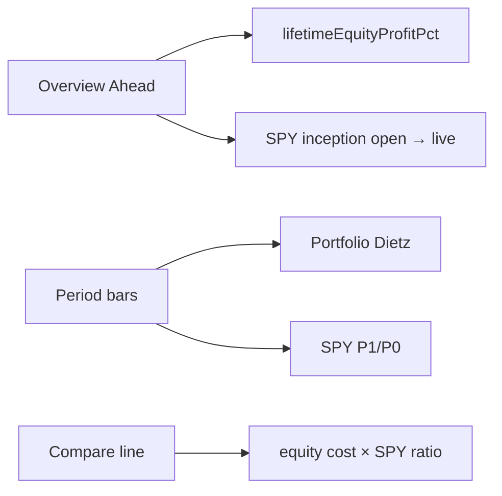
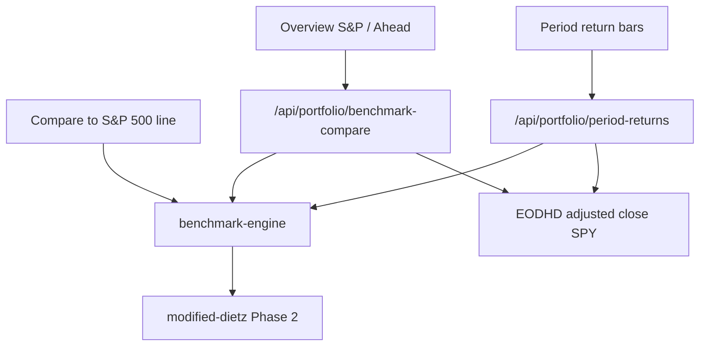

# PORTFOLIO MODULE — PHASE 3 BENCHMARK INTEGRITY

**Date:** 2026-07-21  
**Scope:** Manual Portfolio benchmark comparisons only  
**Mode:** Calculation replacement — **no UI redesign**, no layout/nav/card/typography/chart visual changes, no brokerage/import, no new analytics (Sharpe/Sortino/Beta), no ledger or Dietz changes  
**Depends on:** Phase 1 (ledger), Phase 2 (Modified Dietz)

---

## Final verdict: **PASS**

| Gate | Result |
|------|--------|
| Benchmark audit + dependency map | PASS |
| Single benchmark engine | PASS — `lib/portfolio/benchmark/` |
| Identical methodology (Dietz vs Dietz) | PASS |
| Contribution / cash-flow sync | PASS |
| Overview “Ahead of S&P 500” | PASS — no equity ROC / no simple SPY price Δ |
| Period bars benchmark | PASS — contribution Dietz |
| Chart compare $ path | PASS — contribution NAV (legacy fallback if no cash rows) |
| Price vs total return documented | PASS — EODHD adjusted close |
| Validation A–J | PASS — `npm run portfolio:test` (**49/49**) |
| Regression (ledger / Dietz / UI chrome) | PASS |

---

## 1. Old benchmark methodology

| Surface | Formula | Problem |
|---------|---------|---------|
| Overview S&P card | `rPort = lifetimeEquityROC`; `rSpy = (SPY_now / SPY_inception) − 1`; Ahead = `rPort − rSpy` | **Apples-to-oranges**: equity ROC vs price appreciation; deposits ignored on SPY side |
| Period bars | Portfolio Dietz vs `(P1/P0 − 1)` on SPY | Dietz vs simple price return |
| Chart “Compare to S&P 500” | Scale one notional by `SPY_t / SPY_0` using open equity cost | Ignores mid-period deposits/withdrawals |
| Key Stats tooltips | Placeholder empty metrics | Unchanged (non-goal) |

### Dependency graph (before)



---

## 2. New methodology

| Surface | Formula |
|---------|---------|
| Overview S&P % | Contribution-model **benchmark Modified Dietz** (inception → now) |
| Overview Ahead / Behind | `portfolioDietz − benchmarkDietz` (same window, same external CFs) |
| Period bars | Both sides: Modified Dietz; benchmark NAV from contribution replay |
| Chart compare | Contribution **benchmark NAV** on the same sample dates as portfolio history |

### Engine entry points

| Module | Role |
|--------|------|
| `lib/portfolio/benchmark/benchmark-engine.ts` | Pure: share replay, NAV, Dietz compare, series builder |
| `lib/portfolio/benchmark/benchmark-compare.server.ts` | EOD load + inception compare |
| `POST /api/portfolio/benchmark-compare` | Overview card |

Default ticker: **SPY**.

---

## 3. Benchmark replay model

1. Extract external cash flows (`kind === "cash"` only) — same as Phase 2.
2. Chronologically:
   - **Deposit +A** on day D → buy `A / P_D` shares of SPY  
   - **Withdrawal −A** on day D → sell `A / P_D` shares (floored at 0 shares)
3. **NAV(t)** = shares_held_as_of(t) × `P_t` (last adjusted close on/before t).

This NAV is the dollar path of “every external dollar invested in the benchmark on the same day.”

---

## 4. Cash-flow synchronization

| Portfolio event | Benchmark action |
|-----------------|------------------|
| Cash In $10,000 on Jan 1 | Buy $10,000 of SPY on Jan 1 |
| Cash In $2,000 on Mar 15 | Buy $2,000 of SPY on Mar 15 |
| Cash Out $500 on May 1 | Sell $500 of SPY on May 1 |

Trades, dividends, and fees are **not** mirrored (they are investment results inside the portfolio, not external capital).

Both sides then compute day-weighted Modified Dietz on `(V_B, V_E, CF_window)`.

---

## 5. Validation scenarios

| ID | Scenario | Expected |
|----|----------|----------|
| A | Portfolio NAV tracks contribution SPY | Ahead ≈ **0%** |
| B | Portfolio outperforms | Ahead **> 0** |
| C | Portfolio underperforms | Ahead **< 0** |
| D | Deposit | Benchmark buys same day |
| E | Withdrawal | Benchmark sells same day |
| F | Flat market | Both ~0%, Ahead ~0 |
| G | Bear market | Benchmark < 0; matched → Ahead ~0 |
| H | Bull market | Benchmark > 0; matched → Ahead ~0 |
| I | Multiple cash flows | Shares accumulate correctly |
| J | Large notionals | Finite, stable Ahead |

```bash
npm run portfolio:test
```

---

## 6. Remaining limitations

| Limitation | Severity | Notes |
|------------|----------|-------|
| **Price basis** | Medium | EODHD **adjusted close** (split/dividend-adjusted). Not a separate total-return index ticker. Documented — not silently mixed with raw close. |
| No cash rows in ledger | Low | Chart falls back to legacy single-notional SPY scale; Ahead engine still runs (benchmark NAV may stay 0 until Cash In exists). |
| Withdrawal > benchmark NAV | Low | Shares floored at 0; Dietz still uses full CF amount. |
| Nasdaq compare overlay | Low | Still price-scaled (secondary overlay); SPY path is contribution-model. |
| SPY “Ahead” period | Info | Card remains inception-to-now (UI unchanged). |
| Intraday / timezone | Info | Session marks use EOD calendar (same as portfolio history). |

---

## 7. Performance impact

| Path | Change |
|------|--------|
| Overview | **+1** `POST /api/portfolio/benchmark-compare` (SPY + holding EODs); overview-market no longer needs inception SPY open for Ahead |
| Period returns | Reuses SPY bars already fetched; contribution Dietz O(flows) |
| Chart | Client-side contribution series from existing SPY points + transactions — no extra fetch |

No storage / ledger schema changes. Phase 2 Dietz math untouched.

---

## 8. Future improvements

1. True **total-return** benchmark series if EODHD (or another provider) exposes a TR index without architecture churn.
2. Align Nasdaq compare overlay to the same contribution engine.
3. Optional period-scoped Ahead on the S&P card (would need a small UI period control — out of scope).
4. Precompute / cache contribution NAV snapshots for very large ledgers.

---

## Dependency graph (after)



---

## Rollback

1. Restore overview Ahead to equity ROC − SPY price Δ  
2. Restore period `benchmarkPct` to `P1/P0`  
3. Restore chart `buildBenchmarkCompareLineData` to single-notional scale only  
4. Remove `lib/portfolio/benchmark/*` and `/api/portfolio/benchmark-compare`

Ledger, Phase 2 Dietz, and UI chrome need no rollback.
