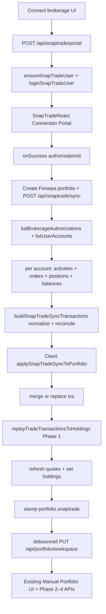
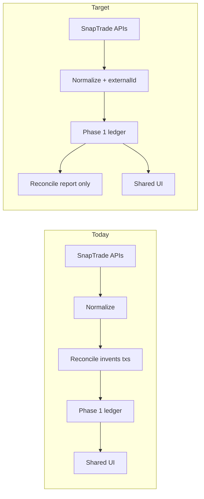

# PORTFOLIO MODULE — PHASE 5A SNAPTRADE AUDIT

**Date:** 2026-07-22  
**Scope:** Existing SnapTrade integration and Connected Portfolio only  
**Mode:** Audit only — **no production code changes** in this phase  
**SDK:** `snaptrade-typescript-sdk` ^10.0.14  
**Prior phases:** Manual Portfolio Phases 1–4 remain canonical for ledger / Dietz / benchmark / analytics  

---

## 1. Executive verdict

### Final Phase 5A verdict: **FAIL**

Connected Portfolio successfully reuses the **post-import** Manual stack (Phase 1 ledger replay → Phase 2–4 engines → existing UI). SnapTrade is largely an upstream importer. That architectural intent is correct.

However, several **hard gates** in the Phase 5 brief are not met today:

| Gate | Status |
|------|--------|
| Stable external transaction identity | **FAIL** — content-hash dedupe only; provider IDs discarded |
| Sync idempotent & concurrency-safe | **WATCH / FAIL** — no lock; full replace can wipe ledger |
| Manual txs never deleted by Sync | **FAIL** — `updateFrom = null` replaces entire ledger |
| Manual vs broker provenance on rows | **FAIL** — no `source` field; portfolio-level “Brokerage” only |
| Async refresh completion before Sync done | **FAIL** — no `refreshBrokerageAuthorization`; no webhooks; Sync = sync HTTP pull of cached Daily data |
| Unknown activities not silently dropped | **FAIL** — unmapped types return `null` |
| Reconciliation without fabricating history | **FAIL** — default `adjustPositionsToBrokerage` invents Buy/Sell/Cash rows |
| Parity fixtures / automated tests | **FAIL** — none for SnapTrade normalization |
| Multi-currency safety | **WATCH** — cash summed as USD without FX validation |

**Pass-adjacent areas:** modern positions/balances/activities/orders APIs (not deprecated combined holdings); partner + user secrets server-only; RLS on `snaptrade_users`; auth on API routes; downstream Manual engines used after import.

---

## 2. Architecture map

### 2.1 End-to-end flow (as implemented)



### 2.2 Components / routes / persistence

| Layer | Path | Role |
|-------|------|------|
| Portal API | `app/api/snaptrade/portal/route.ts` | Create portal redirect URI |
| Sync API | `app/api/snaptrade/sync/route.ts` | Authorization → draft transactions |
| Status / connections | `app/api/snaptrade/status`, `connections`, `connections/[id]` DELETE, `brokerage-logo` | Health, list, disconnect, logo |
| SDK + credentials | `lib/snaptrade/server.ts` | Register/login user; store secrets |
| Sync orchestration | `lib/snaptrade/sync-brokerage.ts` | Resolve accounts; call builder |
| Normalize + reconcile | `lib/snaptrade/build-sync-transactions.ts` | Activities/orders/positions/cash |
| Client merge | `lib/snaptrade/merge-sync-transactions.ts` | Incremental merge + content dedupe |
| Settings / date / copy | `sync-settings.ts`, `sync-update-from.ts`, `sync-copy.ts` | Defaults + UI helpers |
| Connect UI | `connect-brokerage-flow.tsx`, `use-snaptrade-connect-portal.tsx` | Name/privacy + portal |
| Sync UI | `portfolio-snaptrade-sync-modal.tsx`, `portfolio-sync-status-icon.tsx`, `snaptrade-update-from-date-field.tsx` | Sync button + “Updating the data” |
| Apply / auto-sync | `portfolio-workspace-provider.tsx` | Merge, replay, stamp, 24h silent sync |
| Workspace | `app/api/portfolio/workspace/route.ts` + `portfolio_workspace.state` | Persist portfolios/txs/holdings |
| Credentials DB | `supabase/migrations/20260612120000_snaptrade_users.sql` | `snaptrade_users` |
| Phase 1 bridge | `lib/portfolio/rebuild-holdings-from-trades.ts` | Shared ledger after import |

**Server actions:** none for SnapTrade.  
**Webhooks:** none for SnapTrade (Stripe only elsewhere).

### 2.3 Parallel calculation paths

| Stage | Path | Verdict |
|-------|------|---------|
| After sync, holdings | `replayTradeTransactionsToHoldings` → Phase 1 `replayPortfolioLedger` | **Canonical (A)** |
| Returns / charts / benchmark / analytics | Same APIs as Manual (`dietz-returns`, `benchmark-compare`, `analytics`, value-history) | **Canonical** |
| During import | `ledgerCashUsd` (sum of `sum`), `reconcileHoldings`, `reconcileCash`, `emulateHoldingsAsTrades` | **Parallel SnapTrade-only (B-adjacent)** |

**Before:** SnapTrade adapter could be mistaken for a separate portfolio calculator.  
**After (target):** Adapter only normalizes events; Phase 1–4 only. Reconciliation adjustments must be explicit, labeled, and non-destructive to manual provenance.



---

## 3. SnapTrade API usage

### 3.1 Calls in production code

| SDK method | Purpose | Pagination | Retry | Cache | Async completion |
|------------|---------|------------|-------|-------|------------------|
| `authentication.registerSnapTradeUser` | Create user | — | none | DB upsert | sync |
| `authentication.loginSnapTradeUser` | Portal link (`connectionType: "read"`, v4) | — | none | none | sync |
| `connections.listBrokerageAuthorizations` | List / resolve connection | — | none | none | sync |
| `connections.deleteConnection` | Disconnect | — | none | none | sync |
| `accountInformation.listUserAccounts` | Accounts under user | — | none | none | sync |
| `accountInformation.getAccountActivities` | History | offset/limit 1000 | none | SnapTrade Daily cache | sync response; data is Daily |
| `accountInformation.getUserAccountOrders` | Fill gaps | single page `state: "all"` | none | Daily | sync |
| `accountInformation.getAllAccountPositions` | Current positions | — | none | plan-dependent | sync |
| `accountInformation.getUserAccountBalance` | Cash | — | none | plan-dependent | sync |
| `apiStatus.check` | Admin/script health | — | none | none | sync |

**Not used (but official for Daily plans):** `connections.refreshBrokerageAuthorization` — queued async refresh; completion via `ACCOUNT_HOLDINGS_UPDATED` webhook.

**Deprecated combined holdings endpoints:** **not used** (good). Sync uses positions + balances + activities + orders.

### 3.2 Assumptions vs official behavior

| Official SnapTrade behavior | Finsepa today |
|----------------------------|---------------|
| Manual holdings refresh is async; 200 = queued | Never called; Sync pulls current cache immediately |
| `ACCOUNT_HOLDINGS_UPDATED` signals attempt (may include failures) | No webhook handler |
| Activities are Daily; not intraday guaranteed | UI copy partially acknowledges cadence; Sync does not wait for refresh |
| Disabled connection → reconnect flow | Portal supports `reconnectAuthorizationId`; connect UI always posts `{}` |
| Reconnect vs new connection | No product reconnect path wired |

**Risk:** Sync can mark “done” while showing yesterday’s cached activities/positions, especially on Daily plans.

---

## 4. Identifier model

| Identifier | Storage | Notes |
|------------|---------|-------|
| Finsepa user ID | Auth | Equals SnapTrade `userId` |
| SnapTrade userSecret | `snaptrade_users.user_secret` via service role | RLS: revoke anon/authenticated |
| Partner keys | `SNAPTRADE_CLIENT_ID`, `SNAPTRADE_CONSUMER_KEY` env | Server-only |
| `authorizationId` | `portfolio.snaptrade.authorizationId` in workspace JSON | Client-visible |
| SnapTrade `accountId`s | `portfolio.snaptrade.accountIds[]` | All accounts under auth imported together |
| Finsepa portfolio ID | Client UUID in workspace | Stable across syncs |
| Provider activity/order ID | **Not persisted** | Critical gap |
| Manual transaction ID | `PortfolioTransaction.id` | Regenerated for every imported draft on each sync apply |

**Ownership:** API routes use `requireAuthUser` and that user’s SnapTrade credentials. Authorization must appear in that user’s connection list.

**Gaps:** No durable `externalId`; reconnect may create a second Finsepa portfolio (product creates portfolio on connect success); DELETE disconnect API unused in UI; any of the user’s authorizations can be synced into a portfolio if the client supplies the id.

---

## 5. Initial connection lifecycle

Observed path:

1. User chooses Connect brokerage → name + privacy.  
2. `ensureSnapTradeUser` (register or load secret).  
3. Portal link opened via `snaptrade-react`.  
4. On success → Finsepa portfolio created with `snaptrade` link.  
5. Immediate `POST /api/snaptrade/sync` for that `authorizationId`.  
6. All accounts under the authorization are imported into **one** portfolio.  
7. Client applies txs + Phase 1 holdings rebuild.  
8. Workspace persist.

| Check | Finding |
|-------|---------|
| Incomplete initial SnapTrade sync | Accounts empty → sync throws “No accounts found… Wait a minute”; may leave empty/partial portfolio depending on caller error handling |
| Duplicate callback / refresh | New portfolio IDs each connect success → risk of duplicate portfolios for same auth |
| Cancel portal | No portfolio if canceled before success (good) |
| Multi-account | **All** accounts under authorization merged into one portfolio (deliberate but undocumented in UI) |
| History depth | Activities from `updateFrom` or **5 years** back; not “full brokerage history” unless provider returns it |

---

## 6. Sync lifecycle

### 6.1 UX (unchanged visually)

- Sync icon → modal **“Updating the data”**  
- Date field: default = latest existing ledger date; null = “first transaction” / full window  

### 6.2 What “Update from” controls

Documented precisely from code:

1. **Server:** `updateFromYmd` becomes activities `startDate` (else `today − 5y`). Positions/balances/orders still fetched in full for reconcile.  
2. **Client:**  
   - If `updateFrom` set: keep existing txs with `date < updateFrom`, merge imported (content-hash dedupe).  
   - If `updateFrom` **null**: **`transactions = imported` only** — entire prior ledger replaced.

### 6.3 Holdings vs transactions

| Concern | Behavior |
|---------|----------|
| Holdings/cash | Positions + balances used for optional reconcile adjustments |
| Transactions | Activities (+ executed orders) mapped to drafts |
| Completion | Modal closes when HTTP + client apply finish — **not** after provider refresh webhook |
| Auto-sync | If `syncedAt` > ~24h, silent resync; ignores stored `autoSyncDaily === false` nuance in practice (always attempts when stale) |

### 6.4 Concurrency / failure matrix (audit expectations)

| Scenario | Expected risk today |
|----------|---------------------|
| Double-click Sync | Parallel applies; last write wins; no mutex |
| Close modal mid-sync | In-flight request may still apply |
| Two tabs | Race on workspace state |
| Holdings OK, activities empty | Reconcile may invent trades if adjust enabled |
| Webhook twice / late | N/A — no webhooks |
| Provider timeout | Route error / toast; partial apply depends on client |

---

## 7. Transaction normalization map

From `mapActivityToDraft` / `mapExecutedOrderToDraft`:

| Provider signal | Canonical kind | Notes |
|-----------------|----------------|-------|
| type contains DIVIDEND / INCOME | `income` / Dividend | |
| BUY / PURCHASE | `trade` / Buy | |
| SELL / SALE | `trade` / Sell | |
| CONTRIBUTION / DEPOSIT / CASH | `cash` In/Out by sign | Withdrawal by name alone may miss |
| EXECUTED order / filled_quantity | Buy/Sell trade | fee forced 0 |
| Fee / tax / transfer / split / merger / spin-off / FX / unknown | **Dropped (`null`)** | Silent |

**Ordering after import:** date, then kind order cash→trade→other — **not** Phase 1 `sequence`. Sequences assigned later on workspace migrate/persist.

**Date field:** activity trade/settlement parsed via ISO → `yyyy-MM-dd` (trade_date preferred by SnapTrade docs for activities ordering). Settlement vs trade not separately stored.

---

## 8. Idempotency and deduplication

### Current key

```
date|operation|symbol|shares(4dp)|price(2dp)
```

### Hard-gate assessment

| Requirement | Result |
|-------------|--------|
| Prefer provider + account + transaction ID | **Not implemented** |
| Initial import twice | Soft-safe only if content identical |
| Pagination overlap | Soft-safe via content hash |
| Legitimate duplicate economics | **False merge** possible |
| Provider ID changes | Treated as new row |
| Corrected / disappeared activity | No tombstone; reconcile may invent opposite trade |
| Full sync (`updateFrom` null) | Regenerates all Finsepa IDs; destroys prior IDs |

**Update strategy today:** insert-ish merge + content dedupe; reconcile **inserts** synthetic adjustments; no supersede/tombstone model.

---

## 9. Manual transactions in connected portfolios

| Requirement | Finding |
|-------------|---------|
| Source label Manual vs broker on each row | **Missing** — only portfolio subtitle “Brokerage” |
| Sync never deletes manual txs | **Violated** when `updateFrom === null` (full replace) |
| Sync never converts manual → broker | No conversion, but content-hash merge can **drop** a kept manual row that matches an imported key |
| Manual edits only manual records | No source gate — all rows editable alike |
| Broker read-only policy | **Not enforced** in types/UI |
| Coexistence | Possible under incremental sync if dates/keys don’t collide |

---

## 10. Holdings / cash reconciliation

### Source of truth (hybrid)

1. Import builds a transaction list (activities + orders).  
2. Default `adjustPositionsToBrokerage: true` compares replayed shares/`sum` cash to broker snapshots and **appends synthetic Buy/Sell/Cash**.  
3. UI holdings = Phase 1 replay of the **adjusted** list.  
4. Provider current positions are **not** shown as a separate truth surface after sync.

| Status (recommended taxonomy) | When it occurs today |
|------------------------------|----------------------|
| MATCHED | Diff below thresholds |
| HISTORY_INCOMPLETE | Emulation path if enabled and no trades (default emulate = false) |
| UNSUPPORTED_ACTIVITY | Silent drop → often appears as POSITION/CASH mismatch then synthetic fix |
| PROVIDER_MISMATCH | Reconcile invents rows instead of warning |
| MANUAL_ADJUSTMENT | Not distinguished |
| ROUNDING_DIFFERENCE | Share threshold `max(1e-6, 0.1% of broker shares)`; cash $0.01 |

**Product risk:** Incomplete history is papered over with fabricated trades priced at broker avg cost — false precision for P/L and Dietz.

---

## 11. Cost-basis methodology

| Source | Usage |
|--------|-------|
| Transaction replay (Phase 1) | **Canonical after sync** for UI holdings avg cost |
| Provider `average_purchase_price` / cost_basis | Used to price **synthetic** buys and emulation |
| Mixed silently | Yes — synthetic lots use broker avg while real trades use trade prices |

If history starts mid-position, reconcile buy uses broker avg on sync date → cost basis may not match true acquisition.

---

## 12. Manual vs connected parity

**Automated parity fixtures:** **none** in repo for SnapTrade.

**Logical expectation after perfect normalization:** same Phase 1–4 outputs.  
**Today’s blockers to parity:** silent drops, synthetic adjustments, content-hash dedupe, no external IDs, full-replace wiping manual rows, multi-account merge, USD cash assumptions.

Recommended fixtures (Phase 5B): the 17 scenarios in the brief — not executed in 5A.

---

## 13. Returns / charts / benchmark / analytics parity

| Engine | Connected uses shared path? |
|--------|----------------------------|
| Phase 2 Modified Dietz | Yes (same APIs on workspace txs) |
| Phase 3 contribution SPY | Yes |
| Phase 4 analytics | Yes |
| SnapTrade-specific Sharpe/vol/etc. | **None found** |

**Search:** no connected V1/V0 or broker performance %. Chart history follows Manual value-history once txs exist — backfills that rewrite txs will rewrite history.

---

## 14. Multi-account and multi-currency

| Topic | Behavior |
|-------|----------|
| Multiple accounts / one authorization | **All imported into one Finsepa portfolio** |
| One portfolio per account | Not supported |
| Duplicate symbols across accounts | Positions merged in reconcile lists; activities interleaved — lots conflated |
| Currencies | Cash balances summed numerically; symbols treated as USD-centric; **no FX engine** |
| Unsupported multi-currency | Not rejected or marked unavailable |

---

## 15. Connection health and reconnect

| Topic | Status |
|-------|--------|
| Disabled connection errors | Surface as sync/API errors |
| Official reconnect portal param | API accepts `reconnectAuthorizationId`; **UI does not pass it** |
| DELETE connection route | Exists; **no product UI** |
| Portfolio readable offline | Yes — workspace JSON retained |
| Reconnect without duplicate portfolio | **Not guaranteed** — connect success creates portfolio |

---

## 16. Webhook safety

| Item | Status |
|------|--------|
| Handlers | **None** |
| Signature validation | N/A |
| Idempotency / replay | N/A |
| `ACCOUNT_HOLDINGS_UPDATED` | Not consumed |

Phase 5B must either implement authenticated webhooks + refresh, or explicitly document pull-only Daily semantics and avoid claiming live sync completion.

---

## 17. Security review

| Control | Status |
|---------|--------|
| Consumer key server-only | PASS |
| userSecret not in browser | PASS (workspace has auth id, not secret) |
| Route auth | PASS |
| snaptrade_users RLS revoke | PASS |
| Workspace RLS | PASS (existing) |
| IDOR on authorizationId | WATCH — must belong to caller’s SnapTrade user (enforced by list filter) |
| Webhook IDOR | N/A |
| Log redaction | WATCH — verify no secrets in error logs |
| Disconnect ≠ delete portfolio | PASS conceptually (disconnect unused) |

`userSecret` stored as plaintext column (not application-level encryption) — acceptable only if DB encryption at rest is assumed; document as residual risk.

---

## 18. Performance and rate limits

| Observation | Detail |
|-------------|--------|
| Sync fan-out | Per account: activities pages + orders + positions + balances in parallel |
| Activities | Up to 1000/page until exhausted; 5y window worst case |
| Retry / backoff | None |
| Polling | None (good); also no refresh wait |
| Auto-sync | Extra full sync when tab opens if stale |
| Large ledgers | Client-side merge + full Phase 1 replay + workspace PUT |

No measured timings in-repo; Phase 5B should add instrumentation for 1k / 10k txs.

---

## 19. Deterministic test scenarios (required for 5B)

None automated today. Minimum suite:

1. Cash deposit only  
2. One buy / multiple buys / partial / full sell  
3. Deposit + withdrawal  
4. Dividend + fee  
5. Same-day multi-event ordering stability  
6. Manual tx + broker sync incremental  
7. Full sync must **not** delete manual (once fixed)  
8. Duplicate sync idempotent with provider IDs  
9. Unsupported activity → warning, no silent drop  
10. Incomplete history → MATCHED vs HISTORY_INCOMPLETE without fake fills (policy choice)  
11. Multi-account fixture  
12. Webhook replay (when added)

---

## 20. Repository consistency

| Path | Class |
|------|-------|
| `lib/snaptrade/*`, `app/api/snaptrade/*` | Canonical adapter |
| `portfolio-workspace-provider` snaptrade apply | Canonical glue |
| Sync modal / sync icon / connect flow | UI-only (final) |
| `merge-sync-transactions` + dedupe in build | Duplicate key logic |
| `refreshBrokerageAuthorization` | **Dead / missing** vs official guidance |
| Webhook routes | **Missing** |
| Per-tx `source` | **Missing** |
| `reconnectAuthorizationId` in portal | Scaffold / unused by UI |
| DELETE connections | Scaffold / unused by UI |
| Sync settings UI | Partial scaffolding (defaults always sent) |
| Phase 0–4 docs | Explicitly excluded SnapTrade — now superseded by this audit |
| `scripts/snaptrade-test-status.mjs` | Ops |

---

## 21. Ranked risks

| Rank | Risk | Severity |
|------|------|----------|
| 1 | Full sync replaces ledger → **deletes manual txs** | Critical |
| 2 | No provider transaction IDs → non-idempotent history | Critical |
| 3 | Default reconcile **fabricates** trades/cash | Critical |
| 4 | Unknown activities silently dropped | High |
| 5 | Sync completes without async refresh/webhook confirmation | High |
| 6 | No row-level Manual/Broker provenance or broker read-only | High |
| 7 | Content-hash cross-source false dedupe | High |
| 8 | Multi-account / multi-currency conflation | Medium |
| 9 | Reconnect creates duplicate portfolios; disconnect unused | Medium |
| 10 | userSecret plaintext at rest; logging WATCH | Medium |
| 11 | No SnapTrade automated tests | Medium |
| 12 | Ordering before sequence migration not Phase-1-identical | Low–Medium |

---

## 22. Recommended Phase 5B implementation plan

**Do not redesign UI.** Implement defects only, in order:

1. **Provenance** — add canonical `source: "SNAPTRADE" | "MANUAL"` (or existing enum) on transactions; preserve Manual label; broker rows read-only per existing policy.  
2. **External identity** — persist `externalId = snaptrade:{accountId}:{activityId|orderId}`; upsert by externalId.  
3. **Safe merge** — never delete `MANUAL` on sync; full window = upsert broker rows only.  
4. **Activity mapping** — expand map; unknown → structured warning list in sync response (no silent null).  
5. **Reconcile policy** — default off or report-only (`HISTORY_INCOMPLETE`); synthetic txs only behind explicit setting already named, with clear notes + source.  
6. **Refresh semantics** — for Daily plans: optional `refreshBrokerageAuthorization` + webhook or documented poll; do not claim Sync finished until data generation matches plan.  
7. **Reconnect** — wire portal `reconnectAuthorizationId`; keep same Finsepa portfolio.  
8. **Tests** — parity fixtures Manual vs normalized SnapTrade JSON.  
9. **Docs** — `docs/PORTFOLIO-PHASE-5-SNAPTRADE-INTEGRATION.md` with PASS/WATCH/ROLLBACK.

**Non-goals (remain out of scope):** UI redesign, new brokerages, Phase 1–4 formula changes, destructive wipe of valid history without migration.

---

## Appendix A — Sync merge pseudocode (current)

```
imported = draftTxs.map(row => ({ ...row, id: newId(), portfolioId }))
if updateFrom:
  kept = existing.filter(t => t.date < updateFrom)
  // WARNING: kept rows matching imported content-hash are removed
  transactions = merge(kept, imported)
else:
  transactions = imported   // WARNING: drops all previous rows including MANUAL
holdings = Phase1Replay(transactions)
```

## Appendix B — Official references (behavior to match in 5B)

- Activities: Daily cache; paginated; reverse chrono by `trade_date`  
- `refreshBrokerageAuthorization`: async queue; webhook on completion; extra cost; limited on real-time plans  
- `ACCOUNT_HOLDINGS_UPDATED`: attempt result; inspect `details` success/error  
- Disabled connections: reconnect guide — do not create replacement connection casually  

---

**Phase 5A complete. Do not implement fixes until this audit is reviewed.**
