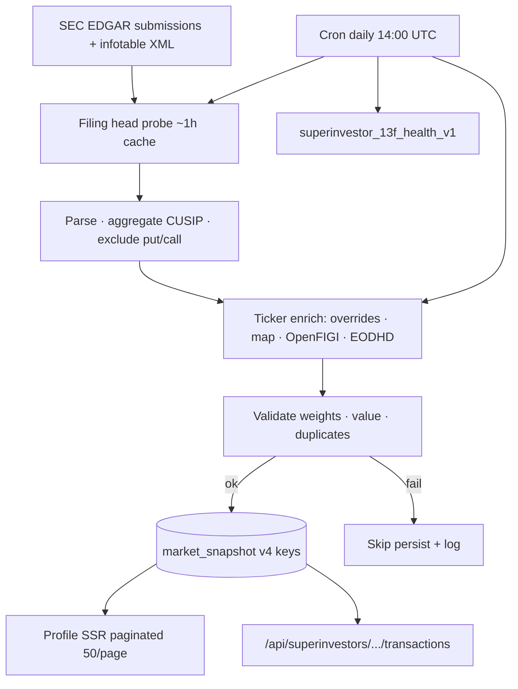

# Superinvestors — Engineering Reference

Living guide for the Finsepa Superinvestors 13F data engine.  
UI/UX is treated as **final** — this doc covers data, caching, ingest, APIs, and ops only.

**Related:** [Phase 0 audit](./SUPERINVESTORS-PHASE-0-SYSTEM-AUDIT.md) · [Phase 1 report](./SUPERINVESTORS-PHASE-1-REPORT.md) · [Phase 3 parity](./SUPERINVESTORS-PHASE-3-REPORT.md)

---

## 1. Goals & non-goals

| Do | Do not |
|----|--------|
| Serve accurate, complete, fresh 13F equity holdings from **SEC EDGAR** | Redesign UI / tabs / navigation |
| Match SEC as source of truth | Match Dataroma when Dataroma diverges from SEC |
| Keep warm SSR/API paths fast via `market_snapshot` | Scrape Dataroma for production data |
| Validate before persist | Fire-and-forget upserts on serverless |

---

## 2. Architecture



**Source of truth:** SEC EDGAR.  
**Benchmark only:** Dataroma (parity scripts).  
**Fixtures:** offline JSON fallback for a few filers when EDGAR is unavailable (Berkshire / Pershing / Fundsmith paths).

---

## 3. Registry (18 managers)

| Slug | Manager | CIK |
|------|---------|-----|
| `berkshire-hathaway` | Warren Buffett | `0001067983` |
| `bill-ackman` | Bill Ackman | `0001336528` |
| `terry-smith` | Terry Smith | `0001569205` |
| `michael-burry` | Michael Burry | `0001649339` |
| `cathie-wood` | Cathie Wood | `0001697748` |
| `li-lu` | Li Lu | `0001709323` |
| `ray-dalio` | Ray Dalio | `0001350694` |
| `ken-fisher` | Ken Fisher | `0000850529` |
| `primecap-management` | PRIMECAP | `0000763212` |
| `ken-griffin` | Ken Griffin | `0001423053` |
| `charlie-munger` | Charlie Munger | `0000783412` |
| `blackrock` | BlackRock | `0002012383` |
| `baillie-gifford` | Baillie Gifford | `0001088875` |
| `renaissance-technologies` | Jim Simons | `0001037389` |
| `point72` | Steven Cohen | `0001603466` |
| `first-eagle` | First Eagle | `0001325447` |
| `chris-hohn` | Chris Hohn | `0001647251` |
| `jeremy-grantham` | Jeremy Grantham | `0001352662` |

- Registry loaders: `lib/superinvestors/superinvestor-registry.ts`
- Slug → CIK (no `server-only`): `lib/superinvestors/superinvestor-slug-cik.ts`
- Engine: `lib/superinvestors/berkshire-13f.ts` (shared institutional 13F parse/compare/tx builders)

---

## 4. Data model & snapshot keys

Table: `market_snapshot` (`key`, `segment`, `data`, `updated_at`).

| Key pattern | Purpose |
|-------------|---------|
| `superinvestor_13f_profile_v4_{cik}` | Full profile page payload (comparison + holdings-scoped tx) |
| `superinvestor_13f_holdings_tx_v4_{cik}` | Holdings-scoped transaction history (Berkshire Activity path) |
| `superinvestor_13f_transactions_full_v4_{cik}` | Full ~filing-history Activity API payload (slim JSON) |
| `superinvestor_13f_health_v1` | Cron health blob |

`segment` = latest accession digits (no dashes). Mismatch vs live SEC head → treat as stale and rebuild.

**Current key generation:** `lib/superinvestors/superinvestor-13f-holdings-transactions-snapshot.ts`

When bumping parse semantics (e.g. options exclusion), bump `vN` / cache prefixes so old rows are not served.

---

## 5. Parsing rules (invariants)

Implemented in `berkshire-13f.ts`:

1. **Equity only for portfolio weights** — rows with `putCall` = put/call are **excluded** before CUSIP aggregate.
2. **Preferred / other equity without `putCall`** are **kept** (SEC truth; Dataroma may drop them).
3. Aggregate by CUSIP (shares + reported value); compute portfolio weights so Σ ≈ 100%.
4. Compare latest vs prior filing for status: new / add / reduce / unchanged / sold.
5. Never “fix” numbers to match Dataroma.

Validation gate (`superinvestor-13f-validate.ts`): empty book, duplicate CUSIPs, weight sum outside ±0.05pp → **do not persist**.

---

## 6. Ingest path

```
load profile (SEC or snapshot)
  → enrich tickers (finalizeSuperinvestorProfileIngest)
  → validate
  → await upsert profile snapshot
```

| Loader | Use |
|--------|-----|
| `loadSuperinvestorProfilePageData(slug, { holdingsPage })` | **SSR / UI only** — holdings sliced to 50/page |
| `loadSuperinvestorProfilePageDataFull(slug)` | **Cron / force-refresh / validate / persist** — full book |
| `forceRefreshSuperinvestorProfilePage(slug)` | Delete CIK snapshots → full reload from SEC |

**Critical:** never validate or persist the paginated page. Doing so makes Σ(weights of top 50) ≠ 100% and blocks snapshot writes.

Entry: `lib/superinvestors/load-superinvestor-profile-data.ts`  
Finalize: `lib/superinvestors/superinvestor-13f-ingest.ts`

---

## 7. APIs & surfaces

| Route | Role |
|-------|------|
| `/superinvestors`, `/superinvestors/[slug]` | Profile SSR (paginated holdings) |
| `/api/superinvestors/[slug]/transactions` | Full Activity history (warm = `transactions_full_v4_*`) |
| `/api/stocks/[ticker]/superinvestors` | Stock-tab manager list for a ticker |
| `/api/cron/superinvestor-13f` | Daily refresh + health (`Authorization: Bearer CRON_SECRET`) |
| `/api/internal/superinvestors-health` | Internal KPIs |

Cron query params:

- `?slug=ken-fisher` — single manager
- `&enrichOnly=1` — skip SEC wipe; re-enrich + persist existing page (large books)

`maxDuration` = 300s. Cloudflare edge often cuts ~100–125s on `app.finsepa.com` — use local/long-timeout hosts for Citadel-sized force-refresh / full-tx cold builds.

---

## 8. Caching layers

1. **Supabase `market_snapshot`** — durable warm path (primary).
2. **Accession-keyed `unstable_cache`** — Next.js process cache keyed by filing head.
3. **Dev memo maps** — cleared on force-refresh.
4. **Filing head probe** — submissions JSON ~1h cache; detects new 13F without full re-parse.

Warm Activity headers (examples): `X-Superinvestor-Tx-Cache`, `X-Superinvestor-Tx-Ms`, `X-Superinvestor-Tx-Read-Ms`, `X-Superinvestor-Tx-Build-Ms`, `X-Superinvestor-Tx-Payload-Bytes`.

Large books (Citadel / RenTech) can still take **~2–5s** on warm JSONB reads — expected, not a correctness failure.

---

## 9. Cron schedule

`vercel.json`: `0 14 * * *` → `GET /api/cron/superinvestor-13f`

Behavior (`refreshAllSuperinvestor13fPortfolios`):

- Missing profile snapshot → `forceRefresh`
- Snapshot present → `loadSuperinvestorProfilePageDataFull` (head probe still catches new filings)
- Enrich unresolved tickers; validate; await upsert; write health

---

## 10. Ops runbook

### Refresh one manager (prod)

```bash
curl -sS -H "Authorization: Bearer $CRON_SECRET" \
  "https://app.finsepa.com/api/cron/superinvestor-13f?slug=michael-burry"
```

### Refresh one manager (local, long timeout — large books)

```bash
curl -sS --max-time 900 -H "Authorization: Bearer $CRON_SECRET" \
  "http://127.0.0.1:3000/api/cron/superinvestor-13f?slug=ken-griffin"
```

### Re-enrich without SEC wipe

```bash
curl -sS -H "Authorization: Bearer $CRON_SECRET" \
  "https://app.finsepa.com/api/cron/superinvestor-13f?slug=ken-fisher&enrichOnly=1"
```

### Warm Activity full-tx after force-refresh

Force-refresh **deletes** `profile` + `holdings_tx` + `transactions_full` for the CIK. Profile is rebuilt by cron; full Activity history is rebuilt on first successful  
`GET /api/superinvestors/{slug}/transactions` cold path (prefer local for Citadel).

Batch helper: `scripts/superinvestor-phase1-backfill.sh`

### Parity / tests

```bash
npm run superinvestors:test
npm run superinvestors:phase3-audit
npm run superinvestors:phase3-validate
npm run superinvestors:metrics
```

---

## 11. Key files

| Area | Path |
|------|------|
| Parse / compare / loaders | `lib/superinvestors/berkshire-13f.ts` |
| Registry | `lib/superinvestors/superinvestor-registry.ts` |
| Profile load / pagination / cron refresh | `lib/superinvestors/load-superinvestor-profile-data.ts` |
| Holdings page slice | `lib/superinvestors/superinvestor-holdings-page.ts` |
| Ingest finalize | `lib/superinvestors/superinvestor-13f-ingest.ts` |
| Validate | `lib/superinvestors/superinvestor-13f-validate.ts` |
| Ticker enrich | `lib/superinvestors/superinvestor-13f-ticker-enrich.ts` |
| Snapshots | `lib/superinvestors/superinvestor-13f-holdings-transactions-snapshot.ts` |
| Full tx warm path | `lib/superinvestors/superinvestor-13f-full-transactions.ts` |
| Tx slim/expand | `lib/superinvestors/superinvestor-13f-transactions-slim.ts` |
| Freshness / head | `lib/superinvestors/superinvestor-13f-freshness.ts` |
| Health | `lib/superinvestors/superinvestor-13f-health.ts` |
| Cron | `app/api/cron/superinvestor-13f/route.ts` |
| Phase 3 audit | `scripts/superinvestor-phase3-parity-audit.mjs` |

---

## 12. Known intentional differences vs Dataroma

| Case | Finsepa / SEC | Dataroma | Reason |
|------|---------------|----------|--------|
| Michael Burry | Includes preferred (e.g. BRUKER) | Often omits preferred | Keep SEC equity |
| First Eagle | Equity count matches SEC | Slightly fewer names | Their filtering |
| Options | Excluded | Typically excluded | Aligned after Phase 3 |
| 11 managers | Tracked | Not listed | N/A |

---

## 13. Adding a manager (checklist)

1. Add CIK + loaders in `berkshire-13f.ts` (or reuse institutional helpers).
2. Register in `superinvestor-registry.ts` + `superinvestor-slug-cik.ts`.
3. Avatar under `public/superinvestors/` if needed.
4. Force-refresh once; confirm `profile_v4_*` row + validation ok.
5. Warm `/api/superinvestors/{slug}/transactions` for full-tx snapshot.
6. Extend Phase 3 `MANAGERS` list in the audit script; run `phase3-validate`.
7. Do **not** change profile UI layout for the new slug beyond existing patterns.

---

## 14. Troubleshooting

| Symptom | Likely cause | Fix |
|---------|--------------|-----|
| Profile missing / stale | Snapshot never persisted | Force-refresh; check validation logs |
| `weight_sum_out_of_tolerance` on cron | Validating paginated 50 rows | Use `loadSuperinvestorProfilePageDataFull` |
| Counts ≫ SEC equity | Options included | Ensure put/call filter + v4 keys |
| Activity empty / cold timeout | `transactions_full_v4_*` missing; CF timeout | Rebuild via local transactions GET |
| Tickers blank | Enrich not run / unmapped CUSIP | `enrichOnly=1` or add override / map |
| Dataroma count lower | Preferred / class filter on their side | Do not change Finsepa; document |

---

## 15. Confidence baseline (post–Phase 3)

- **18/18** profile snapshots match independent SEC equity re-parse (accession, count, value, weights, top holdings).
- Automated gate: `npm run superinvestors:phase3-validate` → expect `PASS=18 FAIL=0`.
- Re-run after any parse or key-version change and after mass force-refresh.
