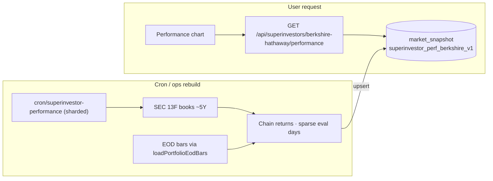

# Superinvestors Performance — Developer Audit

Engineering reference for the Buffett / Berkshire **Performance** tab: what it measures, how the series is built, how it is cached, and how user vs cron paths differ.

**Related:** [Superinvestors engineering](./SUPERINVESTORS-ENGINEERING.md)

---

## 1. Product definition

| Item | Detail |
|------|--------|
| **Who** | All 29 tracked managers (`SUPERINVESTOR_SLUG_CIK`). Gated by `isSuperinvestorPerformanceEnabled`. |
| **Question** | Hypothetical cumulative return of the disclosed SEC 13F **long equity** book vs **SPY** (labeled S&P 500). |
| **Notional** | `$10,000` starting capital (`SUPERINVESTOR_PERF_NOTIONAL_USD`) for both book and SPY $ P&L. |
| **UI** | Profile tab **Performance** → chart ranges 7D / 1M / 6M / YTD / 1Y / 5Y; toggleable legend; portfolio-style headline %. |
| **Disclaimer** | Estimate from 13F longs MTM between filings — **not** Berkshire NAV or investor returns. Excludes cash, shorts, options, non‑US names. |

---

## 2. Architecture



**Invariant (aligned with Superinvestors read-path rules):**

- User/API: **durable snapshot only** — never SEC, never EOD fan-out.
- Rebuild: cron (or authenticated ops) via `rebuildSuperinvestorPerformanceSeries`.
- Missing snapshot → API **503** (“still warming up”); client may retry.

---

## 3. Key files

| Area | Path |
|------|------|
| Types / enablement / notional | `lib/superinvestors/superinvestor-performance-types.ts` |
| Series build + load/rebuild | `lib/superinvestors/superinvestor-performance-series.ts` |
| Durable snapshot R/W | `lib/superinvestors/superinvestor-performance-snapshot.ts` |
| SEC book walk (performance-only) | `loadBerkshirePerformanceBooks` in `lib/superinvestors/berkshire-13f.ts` |
| API | `app/api/superinvestors/[slug]/performance/route.ts` (`maxDuration` 120) |
| Chart UI | `components/superinvestors/superinvestor-performance-chart.tsx` |
| Tab gate | `components/superinvestors/superinvestor-13f-profile-tabs.tsx` |
| Cron hook | `app/api/cron/superinvestor-performance/route.ts` (6 shards daily); optional single-slug warm via `cron/superinvestor-13f?slug=` |

---

## 4. Data model

### API / snapshot payload (`SuperinvestorPerformanceSeries`)

```ts
{
  slug: "berkshire-hathaway",
  label: "Warren Buffett",
  benchmarkLabel: "S&P 500",
  notionalUsd: 10_000,
  fromYmd, toYmd,
  points: [{ t, bookReturnPct, spyReturnPct, bookProfitUsd, spyProfitUsd }, ...],
  coveragePct: number | null,  // % of names priced on first eval day
  disclaimer: string
}
```

### Durable store

| Field | Value |
|-------|--------|
| `market_snapshot.key` | `superinvestor_perf_berkshire_v1` |
| `segment` | calendar day `YYYY-MM-DD` of last upsert |
| Freshness | Serve if `segment === today`, else if `updated_at` within **24h** |
| Next.js cache key | `superinvestor-performance-berkshire-v7-durable` (`unstable_cache`, warm-long revalidate) — used on **rebuild** path only |

---

## 5. How the series is built (rebuild path)

### 5.1 Load 13F books

`loadBerkshirePerformanceBooks()`:

1. Dedicated SEC walk (`fetchPerformance13fSnapshots`) — **not** the profile coalescing path — so Performance rebuild does not contend with Holdings/Activity snapshot work.
2. Walks newest → older infotables with ~120ms pacing; skips empty parses; stops when unique report dates ≥ `5Y × 4 + 1` quarters.
3. Dedupes by report date; reverses to **oldest → newest**.
4. Each book: `{ reportDate, filingDate, accession, positions: [{ ticker, shares, issuer }] }`.
5. Tickers via existing 13F resolver; rows without shares/ticker dropped.
6. Cap **40** positions per book (by shares) before pricing (`MAX_POSITIONS_PER_BOOK`).

### 5.2 Prices

- Universe: all tickers across books + `SPY`.
- `loadPortfolioEodBars(tickers, barsFromYmd, toYmd, { retry: true })`.
- Lookup: close on-or-before date (binary search on sorted EOD days).

### 5.3 Evaluation calendar (sparse MTM)

Not every session day is priced historically (cost / noise):

| Window | Eval points |
|--------|-------------|
| Last **90** calendar days | Every session day |
| Older history | Mondays + first session on/after each filing turn + series endpoints |

Skip days where book coverage &lt; **45%** of names have prices (`MIN_COVERAGE`) — avoids fake crash-to-zero.

### 5.4 Return chaining (critical)

**Within the same 13F book:**  
`bookIndex *= marketValue_t / marketValue_{t-1}` (share-weighted MTM).

**When the active book index changes (new filing):**  
**Do not** multiply by the level jump from old book value → new book value. Share-count changes at filing turns are **not** P&L (sells would otherwise look like crashes).

SPY always chains day-over-day on price: `spyIndex *= spy_t / spy_{t-1}`.

Outputs:

- `bookReturnPct = (bookIndex - 1) × 100`
- `spyReturnPct = (spyIndex - 1) × 100`
- `$` P&L = `10_000 × (index - 1)`

Failures **throw** (never return null into `unstable_cache`) so empty/failed builds are not cached as success.

### 5.5 Persist

Successful build → `upsertBerkshirePerformanceSnapshot(series)` (fire-and-forget `void` from builder; awaited paths may still race — durable row is source of truth for users).

---

## 6. Request paths

### User / chart

1. Client fetches `GET /api/superinvestors/berkshire-hathaway/performance`.
2. `loadSuperinvestorPerformanceSeries` → `readBerkshirePerformanceSnapshot()` only.
3. Hit → 200 + warm cache headers. Miss → **503**.

### Cron / ops rebuild

```bash
curl -H "Authorization: Bearer $CRON_SECRET" \
  "https://<host>/api/cron/superinvestor-13f?slug=berkshire-hathaway"
```

After profile refresh (non-`enrichOnly`), cron calls `rebuildSuperinvestorPerformanceSeries("berkshire-hathaway")` under the SEC rebuild gate.

**Audit note — rebuild short-circuit:**  
`buildBerkshirePerformanceSeriesUncached` currently returns an existing durable snapshot if still “fresh” (today’s segment or &lt;24h old) **before** walking SEC/EOD. So a same-day cron rebuild may **no-op** on Performance while still refreshing the 13F profile. Force a true rebuild by waiting for stale segment/age, or temporarily clearing `superinvestor_perf_berkshire_v1` (prefer not — contradicts “never delete before replace”; a future `force` flag would be cleaner).

---

## 7. UI behavior (chart)

`SuperinvestorPerformanceChart`:

- Loads series once; windows client-side by selected range.
- Rebases displayed returns to **0% at range start** (cumulative from window open, not full-series absolute).
- Downsamples to ≤ **160** points for Lightweight Charts.
- Buffett = baseline/area (up/down fill); SPY = orange line.
- Legend badges toggle series visibility.
- Skeleton = `AssetChartSkeleton`; retries on 503.

---

## 8. Failure modes & lessons learned

| Issue | Behavior / fix |
|-------|----------------|
| Failed build returned `null` into `unstable_cache` | Cached failure → instant “could not build”. **Fix:** throw on failure; durable snapshot as truth. |
| Filing share changes as P&L | Fake crashes on sells. **Fix:** chain only within the same book index. |
| Dense daily MTM over 5Y | Slow / huge EOD fan-out. **Fix:** sparse eval (weekly + turns; daily last 90d). |
| Shared SEC snapshot coalesce with Holdings | Contended cold loads. **Fix:** dedicated `fetchPerformance13fSnapshots`. |
| User waiting on SEC | Violates Superinvestors read invariant. **Fix:** snapshot-only user path + 503 until warm. |

---

## 9. Extending to other managers

Checklist (not implemented):

1. Add slug to `SUPERINVESTOR_SLUG_CIK` and ensure cron warm includes it.
2. Generalize `loadBerkshirePerformanceBooks` → per-CIK performance book loader (reuse institutional parse).
3. New `market_snapshot` key per slug (or namespaced segment).
4. Cron: rebuild when that slug refreshes.
5. Chart label from registry `managerName`; keep SPY benchmark unless product changes.
6. Validate ticker coverage — large books may need higher `MAX_POSITIONS_PER_BOOK` or weight-based top-N.

---

## 10. Ops quick reference

| Action | Command / check |
|--------|------------------|
| Warm / rebuild Buffett perf | Cron `?slug=berkshire-hathaway` (see §6 note on 24h short-circuit) |
| Inspect durable row | `market_snapshot` key `superinvestor_perf_berkshire_v1` |
| Warm user latency | Snapshot read only; typically sub-second after warm |
| Cold rebuild cost | ~20 SEC filings + EOD for book tickers + SPY; API `maxDuration` 120s |

---

## 11. Summary for newcomers

Performance answers a narrow, honest question: **mark-to-market the public 13F long book between filings and compare to SPY**, starting at $10k. It is **not** fund NAV. User traffic never builds the series; cron/ops persist a durable blob; the chart is a client window over that series. The hard part is return math (no fake P&L on filing turns) and keeping rebuilds off the request path.
