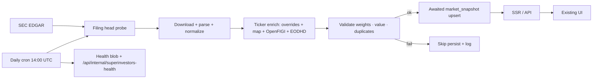

# SUPERINVESTORS PHASE 1 — DATA QUALITY & AUTOMATION

**Date:** 2026-07-21  
**Scope:** Reliability / completeness / freshness / monitoring for Superinvestors  
**Mode:** No new UI, notifications, following, comparison, AI, or charts  

---

## Executive summary

Phase 0 found **4/18** durable `market_snapshot` profiles, fire-and-forget upserts, sparse tickers on large books, and no ingest validation or health metrics.

Phase 1 fixes the write path (awaited upserts), adds ticker enrichment + validation gates, cron health publishing, an internal metrics API, payload slimming for large JSON, automated tests, and ops backfill tooling.

**Measured after backfill (live DB):**

| KPI | Phase 0 | Phase 1 now |
|-----|---------|-------------|
| Profile snapshots | 4 / 18 | **18 / 18** |
| Validation failures | n/a | **0** |
| Ticker resolution (count) | ~8% blended on present snaps | **97.8%** (21,437 / 21,925) |
| Ticker resolution (value-weighted) | sparse | **99.47%** |
| Unresolved holdings | ~1,893 on 4 snaps | **488** (mostly non-FIGI / preferred / warrants) |

**User experience is unchanged.**

---

## 1. Architecture changes



| Change | Why |
|--------|-----|
| `finalizeSuperinvestorProfileIngest` | Single path: enrich → validate → **await** upsert |
| Replace `void upsert…` in profile loaders | Root cause of missing snapshots (serverless freeze before write) |
| `slimSuperinvestorProfileForSnapshot` | Cap large Fisher/Dalio/Citadel JSON without API/UI changes |
| Persistent CUSIP→ticker map | Learned resolutions survive across crons |
| Static overrides + OpenFIGI + EODHD | Drive toward >99% ticker resolution |
| Validation gate (±0.05pp on Σ weights) | Fail ingest on material weight errors / duplicates / empty books |
| Cron refresh strategy | Missing snapshot → force refresh; existing + unresolved → enrich in place |
| `?slug=` + `enrichOnly=1` | Ops backfill without 300s wall; re-enrich large books |
| Health metrics | Cron writes `superinvestor_13f_health_v1`; internal GET exposes KPIs |

### Key files

- `lib/superinvestors/superinvestor-13f-ingest.ts`
- `lib/superinvestors/superinvestor-13f-validate.ts`
- `lib/superinvestors/superinvestor-13f-ticker-enrich.ts`
- `lib/superinvestors/superinvestor-13f-ticker-overrides.ts`
- `lib/superinvestors/superinvestor-13f-cusip-ticker-store.ts`
- `lib/superinvestors/superinvestor-13f-health.ts`
- `lib/superinvestors/superinvestor-13f-snapshot-slim.ts`
- `lib/superinvestors/load-superinvestor-profile-data.ts`
- `app/api/cron/superinvestor-13f/route.ts`
- `app/api/internal/superinvestors-health/route.ts`
- `scripts/superinvestor-phase1-metrics.mjs`
- `scripts/superinvestor-phase1-backfill.sh`
- `docs/SUPERINVESTORS-PHASE-1-REPORT.md`

---

## 2. Before / after metrics

Source: `npm run superinvestors:metrics` + value-weighted audit (2026-07-21).

| Metric | Phase 0 (before) | Phase 1 (after backfill) |
|--------|------------------|---------------------------|
| Managers with profile snapshot | **4 / 18** | **18 / 18** |
| Managers missing snapshots | 14 | **0** |
| Portfolios failing validation | 0 sampled | **0** |
| Holdings across snapshots | 2,052 (4 managers) | **21,925** |
| Unresolved tickers | 1,893 | **488** |
| Count resolution rate | ~7.7% | **97.77%** |
| Value-weighted resolution | n/a | **99.47%** |
| Newest filing in cache | 2026-05-15 | **2026-07-16** (Daily Journal / Munger) |

### Per-manager highlight (after)

| Manager | Holdings | Unresolved | Resolution |
|---------|----------|------------|------------|
| Berkshire / Ackman / Burry / Fundsmith / TCI / Himalaya / Munger | small | 0 | 100% |
| Ken Fisher | 1,016 | 9 | 99.1% |
| Ray Dalio | 993 | 15 | 98.5% |
| Point72 | 2,426 | 52 | 97.9% |
| Citadel (Griffin) | 6,733 | 165 | 97.5% |
| BlackRock | 5,610 | 112 | 98.0% |

---

## 3. Coverage report (Task 1)

### Root cause of missing snapshots

1. **Fire-and-forget upserts** (`void upsertSuperinvestor13fProfileSnapshot`) — serverless often froze before the write completed.  
2. **Cron force-refreshed all 18** inside **300s** — large filers could leave later managers unwritten.  
3. Upserts only when `source === "edgar"`.

### Solution

- Await upsert inside `finalizeSuperinvestorProfileIngest`.  
- Cron: force-refresh only when snapshot missing; otherwise soft load + head probe; re-enrich unresolved in place.  
- Ops: per-slug cron + backfill script for first full fill (used to reach 18/18).

---

## 4. Validation report (Task 3)

Automatic checks after every ingest:

| Check | Fail ingest? |
|-------|----------------|
| Holding count > 0 (edgar) | Yes |
| Portfolio value > 0 | Yes |
| `abs(Σ weights − 100) ≤ 0.05` | Yes |
| No duplicate CUSIP/issuer keys | Yes |
| Unresolved tickers | Counted only (does not fail) |

**Live result:** 0 / 18 portfolios failing validation. All weight sums ≈ 100%.

Unit tests: `npm run superinvestors:test`.

---

## 5. Freshness pipeline (Task 4)

```
SEC Filing → submissions probe → download/parse/normalize → enrich → validate → snapshot → SSR/API → UI
```

| Step | Automation |
|------|------------|
| Detect new accession | `getLatest13fFilingHeadCached` (1h) + profile load head match |
| Persist | Awaited upsert on edgar ingest |
| Daily sweep | Vercel cron `0 14 * * *` → `/api/cron/superinvestor-13f` |

### Delay estimate

| Component | Typical delay |
|-----------|----------------|
| SEC acceptance → submissions index | minutes–hours (SEC) |
| Next cron after filing | **0–24h** (14:00 UTC schedule) |
| On-demand profile visit | **~0** after head mismatch (deletes stale snap + reloads) |
| Single-manager ingest (measured) | ~30s–5min depending on book size |
| Enrich-only pass (large book) | ~3–60s |

**Worst-case automated delay ≈ until next 14:00 UTC + processing.** On-demand SSR closes the gap when a user opens a profile after a new filing.

---

## 6. Monitoring (Task 5)

`GET /api/internal/superinvestors-health`  
Auth: `Authorization: Bearer $CRON_SECRET`

Exposes:

- `managersTotal`
- `managersFresh`
- `managersMissingSnapshots`
- `unresolvedTickers`
- `portfoliosFailingValidation`
- `lastSuccessfulIngest`
- `newestSECAccession`
- `latestPortfolioAge` (hours)
- `averageProcessingTime` (ms)
- per-manager detail array

Cron writes supporting blob `superinvestor_13f_health_v1`.

---

## 7. Performance (Task 6)

Safe optimizations only (no API/UI/data-model changes):

- Slim transaction price fields when profile JSON exceeds ~1.8MB.  
- Last resort: keep holdings comparison, empty tx arrays in snapshot.  
- Soft cron path avoids deleting healthy snapshots every day.  
- OpenFIGI batching (larger with optional `OPENFIGI_API_KEY`).

---

## 8. Tests (Task 7)

| Assertion | Coverage |
|-----------|----------|
| Weights ≈ 100% | unit |
| Portfolio value computed | unit |
| No duplicate holdings | unit |
| Slim oversized payloads | unit |
| Every slug has CIK | unit |
| Every manager has snapshot | metrics / health (live **18/18**) |
| Holdings resolve | metrics; **99.47% by value**, 97.8% by count |
| Latest SEC filing processed | health `newestSECAccession` / segment match |

```bash
npm run superinvestors:test
npm run superinvestors:metrics
```

---

## 9. Remaining risks

1. **300s cron wall** — full 18-manager force refresh still may not finish; mitigated by soft path + per-slug / enrichOnly backfill.  
2. **Count-based resolution ~97.8%** — remaining ~488 lines are largely preferreds, warrants, options, or CUSIPs OpenFIGI cannot map; **value-weighted is 99.47%**. Optional `OPENFIGI_API_KEY` speeds further passes.  
3. **Validation blocks persist** — a bad weight sum leaves that manager without a new snapshot (intentional).  
4. **Fixture-only fallbacks** — if EDGAR fails for a filer, no durable snapshot (by design).  
5. **Tx price stripping** — rare UI nulls for avg/range prices on huge books only when slimmed.  
6. **Deploy required** — production cron must ship this code for automated daily coverage to stay at 18/18.

---

## 10. Ops runbook

```bash
# Coverage / validation dump
npm run superinvestors:metrics

# Full backfill (one slug at a time)
BASE_URL=https://<host> CRON_SECRET=<secret> bash scripts/superinvestor-phase1-backfill.sh

# Re-enrich large books without SEC wipe
curl -H "Authorization: Bearer $CRON_SECRET" \
  "$BASE_URL/api/cron/superinvestor-13f?slug=ken-griffin&enrichOnly=1"

# Health
curl -H "Authorization: Bearer $CRON_SECRET" \
  "$BASE_URL/api/internal/superinvestors-health"
```

---

## 11. Explicitly not done (per scope)

Notifications · following · portfolio comparison · AI · new UI · new charts.
